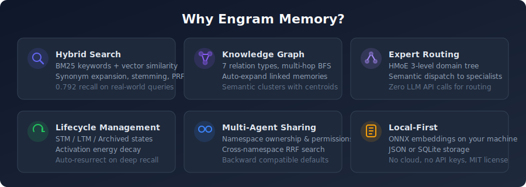
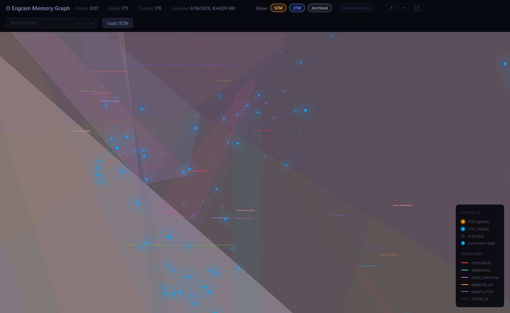
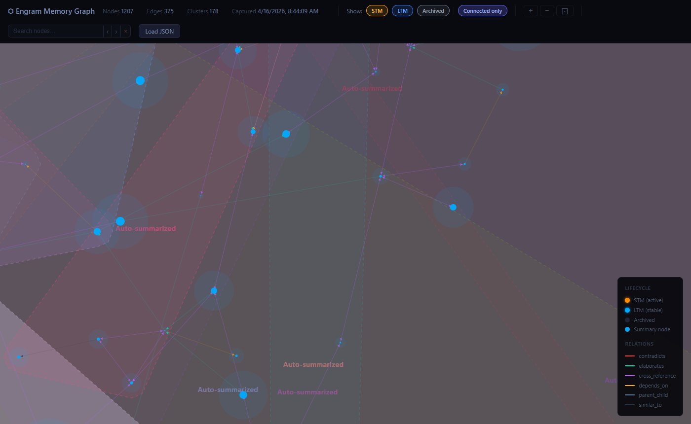
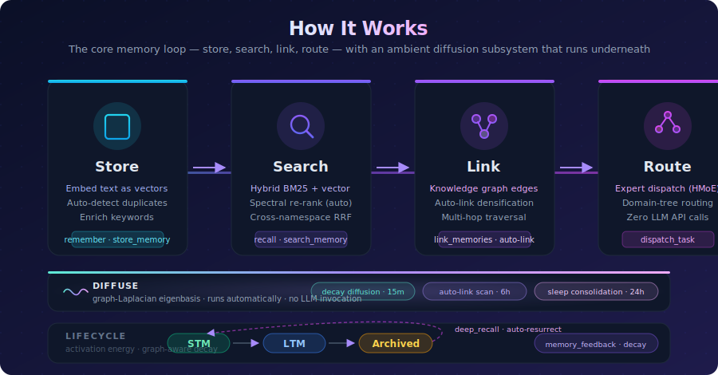
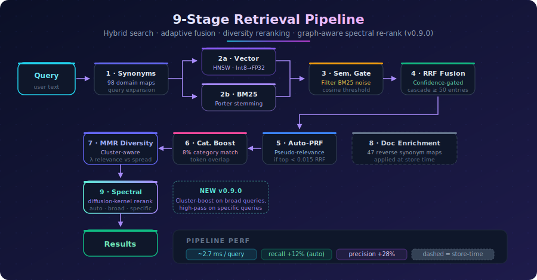

<p align="center">
  
</p>

<p align="center">
  <a href="https://dotnet.microsoft.com/"></a>
  <a href="https://opensource.org/licenses/MIT"></a>
  <a href="https://www.nuget.org/packages/McpEngramMemory.Core"></a>
  <a href="https://github.com/wyckit/mcp-engram-memory/packages"></a>
  
  
</p>

**Give your AI agent persistent memory that survives across sessions.** Store decisions, recall context, and build expertise — all locally, no cloud required.

A cognitive memory engine exposed as an [MCP](https://modelcontextprotocol.io/) server with hybrid search (BM25 + vector), knowledge graph, lifecycle management, and hierarchical expert routing.

<p align="center">
  
</p>

## Quickstart

**Option 1 — One-click setup script** (clones, restores, and wires up Claude Code automatically)

```powershell
# Windows PowerShell
irm https://raw.githubusercontent.com/wyckit/mcp-engram-memory/main/setup.ps1 | iex
```

```bash
# macOS / Linux
curl -fsSL https://raw.githubusercontent.com/wyckit/mcp-engram-memory/main/setup.sh | bash
```

Both scripts clone the repo, download the ONNX model, and patch `~/.claude.json` with the MCP server entry. Optional flags: `--profile minimal|standard|full`, `--storage json|sqlite`, `--agent-id <id>`. Already cloned? Run `pwsh setup.ps1` or `bash setup.sh` from the repo root.

**Option 2 — Clone and configure manually**

```bash
git clone https://github.com/wyckit/mcp-engram-memory.git
cd mcp-engram-memory
dotnet restore
```

Add to your MCP client config (Claude Code, Copilot, Gemini, Codex):

```json
{
  "mcpServers": {
    "engram-memory": {
      "command": "dotnet",
      "args": ["run", "--project", "/path/to/mcp-engram-memory/src/McpEngramMemory"],
      "env": { "MEMORY_TOOL_PROFILE": "minimal" }
    }
  }
}
```

**Option 3 — Docker**

```bash
docker build -t mcp-engram-memory .
docker run -i -v memory-data:/app/data mcp-engram-memory
```

**Option 4 — NuGet library** (embed the engine in your own app)

```bash
dotnet add package McpEngramMemory.Core --version 0.8.1
```

> First run downloads a ~5.7 MB embedding model (bge-micro-v2) — subsequent starts are instant.

See [`examples/`](examples/) for ready-to-use config files and AI assistant harness templates.

## Memory Graph Visualizer

The built-in D3.js graph viewer lets you explore your memory graph interactively.

**Generate a snapshot** (call this MCP tool from any AI assistant):
```
get_graph_snapshot   →   save the JSON   →   open visualization/memory-graph.html
```

<p align="center">
  
</p>

<p align="center">
  
</p>

**Features:**
- **Force-directed layout** — related memories cluster together, typed edges (elaborates, contradicts, depends_on, …) shown in distinct neon colors
- **Lifecycle colors** — STM nodes amber, LTM nodes blue; cluster summaries marked with a dashed ring
- **Convex-hull cluster overlays** — cluster membership visible at a glance
- **Search & highlight** — type in the search bar to instantly dim non-matching nodes and pulse-highlight matches in gold; `‹ ›` buttons or `Enter / Shift+Enter` to cycle through results
- **Zoom / pan / rotate** — `+` / `−` / `⊡` buttons; scroll to zoom; right-click drag to rotate the whole graph
- **Fractal density overlay** — zooms out reveal a quadtree density map color-coded by lifecycle state
- **Connected-only filter** — hide isolated nodes to focus on the linked knowledge graph
- **Drag-and-drop JSON loading** — drop a snapshot file directly onto the viewer

The snapshot file is not committed (it's personal memory data). Generate a fresh one any time with `get_graph_snapshot`.

## Tool Profiles

Control how many tools are exposed with `MEMORY_TOOL_PROFILE`:

| Profile | Tools | What's included |
|---------|-------|-----------------|
| `minimal` | 16 | Core CRUD + composite + admin + multi-agent — recommended starting point |
| `standard` | 35 | Adds graph, lifecycle, clustering, intelligence |
| `full` | 55 | Everything including expert routing, debate, synthesis, benchmarks (default) |

## At a Glance

| Metric | Value |
|--------|-------|
| MCP tools | 55 (profiles: 16 / 35 / 55) |
| Retrieval | Hybrid BM25 + vector with synonym expansion, cascade retrieval, MMR diversity, auto-PRF |
| Embedding | bge-micro-v2 (384-dim, ONNX, MIT license, runs locally, concurrent inference) |
| Best recall | **0.792** realworld dataset, **0.771** scale dataset (hybrid mode) |
| Search latency | ~2.7 ms production, ~0.04 ms benchmark |
| Storage | JSON (default) or SQLite (WAL mode) |
| Frameworks | net8.0, net9.0, net10.0 |
| Tests | 865 non-MSA net8 tests across 49 files |
| CI/CD | GitHub Actions: build + test on push, nightly MSA benchmarks |

### System Layers

| Layer | Stability | Components |
|-------|-----------|------------|
| **Core** | Stable | Storage, Embeddings, Retrieval, Lifecycle, Graph |
| **Advanced** | Stable | Clustering, Multi-Agent Sharing, Intelligence |
| **Orchestration** | Maturing | Expert Routing (HMoE), Debate, Benchmarks |

<p align="center">
  
</p>

<p align="center">
  
</p>

## AI Assistant Setup

Copy the reference harness for your tool — each includes recall/store/routing patterns:

| Tool | Harness File | MCP Config |
|------|-------------|------------|
| Claude Code | [`examples/CLAUDE.md`](examples/CLAUDE.md) → `~/.claude/CLAUDE.md` | [`examples/claude-code.json`](examples/claude-code.json) |
| GitHub Copilot | [`examples/copilot-instructions.md`](examples/copilot-instructions.md) → `.github/` | [`examples/vscode-copilot.json`](examples/vscode-copilot.json) |
| Google Gemini | [`GEMINI.md`](GEMINI.md) → workspace root | [Gemini CLI config](https://github.com/google/gemini-cli) |
| OpenAI Codex | [`examples/AGENTS.md`](examples/AGENTS.md) → project root | [Codex config](https://github.com/openai/codex) |

> **Claude Code users**: Route memory sub-agents to Sonnet (`model: "sonnet"`) and utility sub-agents to Haiku (`model: "haiku"`) to maximize your subscription. See the [harness](examples/CLAUDE.md) for details.

For step-by-step setup prompts, see [AI Assistant Setup](docs/ai-assistant-setup.md).

### Cost-Optimized Usage (Claude Code)

| Tier | Model | What runs here |
|------|-------|----------------|
| **Main thread** | Opus | Coding, architecture, reasoning, decisions |
| **Memory sub-agents** | Sonnet (`model: "sonnet"`) | All engram MCP tool calls: search, store, dispatch, link, merge |
| **Utility sub-agents** | Haiku (`model: "haiku"`) | Codebase exploration, file searches, grep research, simple lookups |

Opus thinks, Sonnet remembers, Haiku explores.

## MCP Tools (55)

| Group | Tools | Description |
|-------|-------|-------------|
| Core Memory | `store_memory`, `store_batch`, `search_memory`, `delete_memory` | Vector CRUD with namespace isolation, batch import, and lifecycle-aware search |
| Composite | `remember`, `recall`, `reflect`, `get_context_block` | High-level wrappers with auto-dedup, auto-linking, expert routing, and context assembly |
| Knowledge Graph | `link_memories`, `unlink_memories`, `get_neighbors`, `traverse_graph` | Directed graph with 7 relation types and multi-hop BFS traversal |
| Clustering | `create_cluster`, `update_cluster`, `store_cluster_summary`, `get_cluster`, `list_clusters` | Semantic grouping with auto-computed centroids |
| Lifecycle | `promote_memory`, `memory_feedback`, `deep_recall`, `decay_cycle`, `configure_decay` | State transitions (STM/LTM/archived), activation energy decay |
| Intelligence | `detect_duplicates`, `find_contradictions`, `merge_memories`, `uncollapse_cluster`, `list_collapse_history` | Dedup, contradiction detection, merge, collapse reversal |
| Expert Routing | `dispatch_task`, `create_expert`, `get_domain_tree`, `link_to_parent` | HMoE semantic routing with 3-level domain tree |
| Multi-Agent | `cross_search`, `share_namespace`, `unshare_namespace`, `list_shared`, `whoami` | Namespace sharing, permissions, cross-namespace RRF search |
| Debate | `consult_expert_panel`, `map_debate_graph`, `resolve_debate`, `purge_debates` | Multi-perspective analysis with debate tracking |
| Synthesis | `synthesize_memories` | Map-reduce synthesis via local SLM (Ollama) |
| Accretion | `get_pending_collapses`, `collapse_cluster`, `dismiss_collapse`, `trigger_accretion_scan` | DBSCAN cluster detection and two-phase summarization |
| Admin | `get_memory`, `cognitive_stats`, `get_metrics`, `reset_metrics` | Inspection, system-wide statistics, and latency metrics |
| Maintenance | `rebuild_embeddings`, `compression_stats` | Re-embed entries and storage diagnostics |
| Benchmarks | `run_benchmark`, `run_agent_outcome_benchmark`, `run_live_agent_outcome_benchmark`, `compare_live_agent_outcome_artifacts` | IR quality validation, proxy memory-condition comparison, live-model memory A/B benchmarking, and artifact-to-artifact diff reporting |

Full tool documentation: [MCP Tools Reference](docs/mcp-tools-reference.md)

## Environment Variables

| Variable | Default | Description |
|----------|---------|-------------|
| `MEMORY_TOOL_PROFILE` | `full` | Tool profile: `minimal` (16), `standard` (35), `full` (55) |
| `AGENT_ID` | `default` | Agent identity for multi-agent namespace sharing |
| `MEMORY_STORAGE` | `json` | Storage backend: `json` or `sqlite` |
| `MEMORY_SQLITE_PATH` | `data/memory.db` | SQLite database path (when `MEMORY_STORAGE=sqlite`) |
| `MEMORY_MAX_NAMESPACE_SIZE` | unlimited | Max entries per namespace |
| `MEMORY_MAX_TOTAL_COUNT` | unlimited | Max total entries across all namespaces |

## NuGet / GitHub Packages

The core engine is available as a NuGet package for embedding in your own .NET applications:

```bash
# nuget.org
dotnet add package McpEngramMemory.Core --version 0.8.1

# GitHub Packages
dotnet add package McpEngramMemory.Core --version 0.8.1 \
  --source https://nuget.pkg.github.com/wyckit/index.json
```

```csharp
using McpEngramMemory.Core.Services;
using McpEngramMemory.Core.Services.Storage;

var persistence = new PersistenceManager();
var embedding = new OnnxEmbeddingService();
var index = new CognitiveIndex(persistence);

// Store
var vector = embedding.Embed("The capital of France is Paris");
var entry = new CognitiveEntry("fact-1", vector, "default", "The capital of France is Paris", "facts");
index.Upsert(entry);

// Search
var results = index.Search(embedding.Embed("French capital"), "default", k: 5);
```

## Documentation

| Doc | Description |
|-----|-------------|
| [First 5 Minutes](docs/first-5-minutes.md) | Store, close, recall — the whole loop |
| [Cheat Sheet](docs/cheat-sheet.md) | One-page quick reference |
| [MCP Tools Reference](docs/mcp-tools-reference.md) | Full documentation for all 55 tools |
| [Architecture](docs/architecture.md) | System design, retrieval pipeline, data flow |
| [Services](docs/services.md) | All services with descriptions |
| [Internals](docs/internals.md) | Retrieval, quantization, persistence deep dive |
| [Project Structure](docs/project-structure.md) | File tree and module organization |
| [AI Assistant Setup](docs/ai-assistant-setup.md) | Step-by-step setup prompts for each tool |
| [Sample Prompts](docs/prompts.md) | Power prompts and usage patterns |
| [Benchmarks](docs/benchmarks.md) | IR quality results and mode selection guide |
| [MRCR v2 Benchmark](docs/benchmarks-mrcr.md) | Long-context A/B (full context vs. hybrid retrieval) via Claude CLI subscription |
| [Testing](docs/testing.md) | Test coverage breakdown and current CI coverage |

## Build & Test

```bash
cd mcp-engram-memory
dotnet build
dotnet test    # full suite, including slower MSA benchmark cases
```

## Tech Stack

- .NET 8/9/10, C#
- [ModelContextProtocol](https://www.nuget.org/packages/ModelContextProtocol) 1.0.0
- [FastBertTokenizer](https://www.nuget.org/packages/FastBertTokenizer) 0.4.67
- [Microsoft.ML.OnnxRuntime](https://www.nuget.org/packages/Microsoft.ML.OnnxRuntime) 1.17.0
- [bge-micro-v2](https://huggingface.co/TaylorAI/bge-micro-v2) ONNX (384-dim, MIT license)
- [Microsoft.Data.Sqlite](https://www.nuget.org/packages/Microsoft.Data.Sqlite) 8.0.11
- xUnit (tests)

## License

MIT
