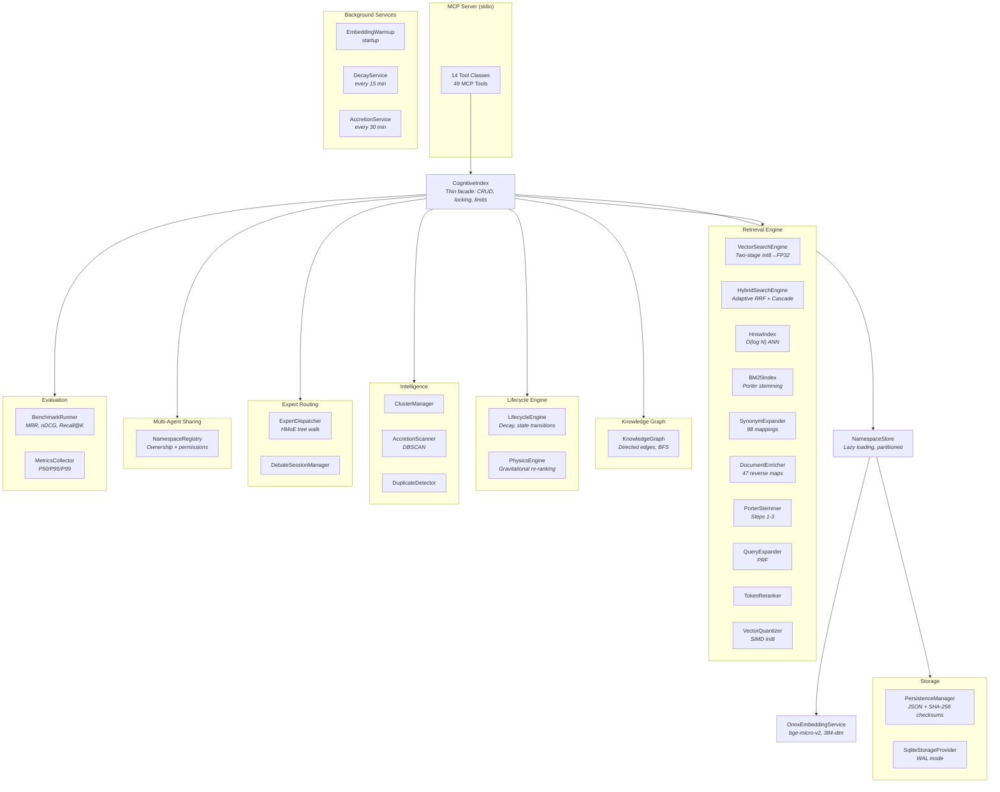

# MCP Engram Memory

A local-first cognitive memory engine for AI agents, exposed as an MCP server. Provides namespace-isolated vector storage, high-quality hybrid retrieval (BM25 + vector fusion with Porter stemming, synonym expansion, cascade retrieval, and pseudo-relevance feedback), a knowledge graph, semantic clustering, lifecycle management with activation energy decay, hierarchical expert routing (HMoE), multi-agent namespace sharing, and physics-based re-ranking. Supports JSON and SQLite persistence backends.

## Quickstart

**Option 1 — dotnet (recommended)**

```bash
git clone https://github.com/wyckit/mcp-engram-memory.git
cd mcp-engram-memory
dotnet build
```

Add to your MCP client config (Claude Code, Copilot, etc.):

```json
{
  "mcpServers": {
    "engram-memory": {
      "command": "dotnet",
      "args": ["run", "--project", "/path/to/mcp-engram-memory/src/McpEngramMemory"]
    }
  }
}
```

**Option 2 — Docker**

```bash
docker build -t mcp-engram-memory .
docker run -i -v memory-data:/app/data mcp-engram-memory
```

**Option 3 — NuGet (embed in your app)**

```bash
dotnet add package McpEngramMemory.Core --version 0.5.4
```

That's it. The server exposes 49 MCP tools. To reduce tool count, set `MEMORY_TOOL_PROFILE`:

| Profile | Tools | Use case |
|---------|-------|----------|
| `minimal` | 13 | Core CRUD + admin + composite + multi-agent tools — drop-in memory for any agent |
| `standard` | 32 | Adds graph, lifecycle, clustering, intelligence |
| `full` | 49 | Everything including expert routing, debate, benchmarks (default) |

```json
{
  "env": { "MEMORY_TOOL_PROFILE": "minimal" }
}
```

See [`examples/`](examples/) for ready-to-use config and harness files:

| File | Purpose |
|------|---------|
| `claude-code.json` | MCP server config for Claude Code (full profile) |
| `claude-code-minimal.json` | MCP server config for Claude Code (minimal profile) |
| `CLAUDE.md` | Reference harness for Claude Code with cost-optimized model routing |
| `copilot-instructions.md` | Reference harness for GitHub Copilot |
| `AGENTS.md` | Reference harness for OpenAI Codex |
| `vscode-copilot.json` | MCP server config for VS Code Copilot |
| `docker-compose.yml` | Docker deployment example |

## At a Glance

| Metric | Value |
|--------|-------|
| MCP tools | 49 (profiles: 13 minimal / 32 standard / 49 full) |
| Retrieval modes | vector, hybrid (BM25+vector), vector_rerank, hybrid_rerank |
| Embedding model | bge-micro-v2 (384-dim, ONNX, MIT license) |
| Best recall (scale, 80 seeds) | **0.771** hybrid — cascade retrieval eliminates BM25 noise |
| Best recall (realworld, 30 seeds) | **0.792** hybrid — synonym expansion bridges vocab gaps |
| Search latency (P50) | ~0.04 ms (benchmark), ~2.7 ms (production) |
| Quantization | Int8 scalar, 75% disk reduction, SIMD-accelerated |
| Storage backends | JSON (default) or SQLite (WAL mode) |
| Target frameworks | net8.0, net9.0, net10.0 |
| Tests | 609 across 37 test files |

### System Layers

| Layer | Stability | Components | Purpose |
|-------|-----------|------------|---------|
| **Core** | Stable | Storage, Embeddings, Retrieval, Lifecycle, Graph | Memory CRUD, search, decay, knowledge links |
| **Advanced** | Stable | Clustering, Multi-Agent Sharing, Intelligence | Accretion/collapse, namespace permissions, dedup/contradictions |
| **Orchestration** | Maturing | Expert Routing (HMoE), Debate, Benchmarks | Semantic dispatch, multi-perspective analysis, IR quality validation |

**Core** is production-grade. **Advanced** is stable and well-tested. **Orchestration** is powerful but still evolving — treat as an extension layer.

## Architecture



### The Core Memory Loop

```
INGEST → ENRICH → INDEX → RETRIEVE → REINFORCE → DECAY → SUMMARIZE/COLLAPSE
   │        │                │           │           │              │
   └── store_memory          │    memory_feedback    │    collapse_cluster
       (embed + upsert)      │    (agent feedback)   │    (DBSCAN → summary)
                │             └── search_memory       └── decay_cycle
          DocumentEnricher        (hybrid pipeline)   (activation energy)
          (auto-keywords)
```

Memories move through lifecycle states based on usage:

```
STM (short-term) ──promote──→ LTM (long-term) ──decay──→ Archived
                   ←─────────────────────────────────── deep_recall
                              (auto-resurrect if score ≥ 0.7)
```

### Retrieval Pipeline (v0.5.4)

The hybrid search pipeline applies six stages to maximize recall without sacrificing precision:

```
Query → Synonym Expansion → Vector Search ──┐
              │                              ├─→ Adaptive RRF Fusion ──→ Auto-PRF ──→ Category Boost ──→ Results
              └──→ BM25 Search ──────────────┘         │
                   (Porter stemming)              Cascade mode
                                               (≥50 entries: BM25
                                                boosts vector only)
```

1. **Synonym Expansion**: Query terms are expanded using 98 domain synonym mappings (e.g., "maintenance" → accretion/decay/collapse, "encrypt" → TLS/cipher/cryptography)
2. **Dual-Path Search**: Vector cosine similarity (with HNSW for large namespaces) runs in parallel with BM25 keyword search (with Porter stemming and compound tokenization)
3. **Adaptive RRF Fusion**: Confidence-gated Reciprocal Rank Fusion — high vector confidence (>0.70) suppresses BM25 noise, low confidence (<0.50) amplifies BM25 rescue. For namespaces ≥50 entries, cascade mode uses BM25 as a precision booster (up to 15%) instead of introducing new candidates
4. **Auto-PRF**: When top result score is low (<0.015 RRF), Pseudo-Relevance Feedback extracts key terms from initial results and re-searches. Only used if PRF improves the top score
5. **Category Boost**: 8% score boost when query tokens overlap with entry categories, improving disambiguation at scale
6. **Document Enrichment** (at store time): `DocumentEnricher` auto-generates keyword aliases from entry text using 47 reverse synonym mappings, so BM25 indexes both technical text and colloquial equivalents

## Project Structure

The solution is split into two projects:

| Project | Type | Description |
|---------|------|-------------|
| `McpEngramMemory` | Executable | MCP server with stdio transport — register this in your MCP client |
| `McpEngramMemory.Core` | NuGet Library | Core engine (vector index, graph, clustering, lifecycle, persistence) — use this to embed the memory engine in your own application |

```
src/
  McpEngramMemory/              # MCP server (Program.cs + Tool classes)
  McpEngramMemory.Core/         # Core library
    Models/                     # CognitiveEntry, SearchResults, MemoryLimitsConfig, etc.
    Services/
      CognitiveIndex.cs         # Thin facade: CRUD, locking, delegates to engines below
      NamespaceStore.cs         # Namespace-partitioned storage with lazy loading
      PhysicsEngine.cs          # Gravitational force re-ranking
      Retrieval/                # Search pipeline
        VectorMath.cs           #   SIMD-accelerated dot product & norm
        VectorSearchEngine.cs   #   Two-stage Int8 screening + FP32 reranking
        HnswIndex.cs            #   HNSW approximate nearest neighbor index
        HybridSearchEngine.cs   #   Adaptive RRF + cascade retrieval for large namespaces
        BM25Index.cs            #   Keyword search with Porter stemming & compound tokenization
        SynonymExpander.cs      #   Query-time domain synonym expansion (98 mappings)
        DocumentEnricher.cs     #   Store-time keyword enrichment (47 reverse maps)
        PorterStemmer.cs        #   Lightweight Porter stemmer (steps 1-3)
        QueryExpander.cs        #   IDF-based query expansion + pseudo-relevance feedback
        TokenReranker.cs        #   Token-overlap reranker (implements IReranker)
        VectorQuantizer.cs      #   Int8 scalar quantization
        IReranker.cs            #   Pluggable reranker interface
      Graph/
        KnowledgeGraph.cs       #   Directed graph with adjacency lists
      Intelligence/
        ClusterManager.cs       #   Semantic cluster CRUD + centroid computation
        AccretionScanner.cs     #   DBSCAN density scanning + reversible collapse
        DuplicateDetector.cs    #   Pairwise cosine similarity duplicate detection
        AutoSummarizer.cs       #   TF-IDF keyword extraction for cluster summaries
        AccretionBackgroundService.cs
      Lifecycle/
        LifecycleEngine.cs      #   Decay, state transitions, deep recall
        DecayBackgroundService.cs
      Experts/
        ExpertDispatcher.cs     #   Semantic routing to expert namespaces
        DebateSessionManager.cs #   Debate session state + alias mapping
      Evaluation/
        BenchmarkRunner.cs      #   IR quality benchmarks
        MetricsCollector.cs     #   Operational metrics + percentiles
      Storage/
        IStorageProvider.cs     #   Storage abstraction interface
        PersistenceManager.cs   #   JSON file backend with debounced writes
        SqliteStorageProvider.cs #   SQLite backend with WAL mode
      Sharing/
        NamespaceRegistry.cs    #   Multi-agent namespace ownership & permissions
tests/
  McpEngramMemory.Tests/        # xUnit tests (609 tests across 37 test files)
benchmarks/
  baseline-v1.json              # Sprint 1 baseline (2026-03-07)
  baseline-paraphrase-v1.json
  baseline-multihop-v1.json
  baseline-scale-v1.json
  2026-03-10-ablation/          # First ONNX ablation study (10 configs across 5 datasets x 4 modes)
  2026-03-20/                   # Day 10 stability test (12 configs + operational metrics)
  ideas/                        # Benchmark proposals and analysis
```

## NuGet Package

The core engine is available as a NuGet package for use in your own .NET applications.

```bash
dotnet add package McpEngramMemory.Core --version 0.5.4
```

### Library Usage

```csharp
using McpEngramMemory.Core.Models;
using McpEngramMemory.Core.Services;
using McpEngramMemory.Core.Services.Graph;
using McpEngramMemory.Core.Services.Intelligence;
using McpEngramMemory.Core.Services.Lifecycle;
using McpEngramMemory.Core.Services.Storage;

// Create services
var persistence = new PersistenceManager();
var embedding = new OnnxEmbeddingService();
var index = new CognitiveIndex(persistence);
var graph = new KnowledgeGraph(persistence, index);
var clusters = new ClusterManager(index, persistence);
var lifecycle = new LifecycleEngine(index, persistence);

// Store a memory
var vector = embedding.Embed("The capital of France is Paris");
var entry = new CognitiveEntry("fact-1", vector, "default", "The capital of France is Paris", "facts");
index.Upsert(entry);

// Search by text
var queryVector = embedding.Embed("French capital");
var results = index.Search(queryVector, "default", k: 5);
```

## Tech Stack

- .NET 8/9/10, C#
- [ModelContextProtocol](https://www.nuget.org/packages/ModelContextProtocol) 1.0.0
- [FastBertTokenizer](https://www.nuget.org/packages/FastBertTokenizer) 0.4.67 (WordPiece tokenization)
- [Microsoft.ML.OnnxRuntime](https://www.nuget.org/packages/Microsoft.ML.OnnxRuntime) 1.17.0 (ONNX model inference)
- [Microsoft.Data.Sqlite](https://www.nuget.org/packages/Microsoft.Data.Sqlite) 8.0.11 (SQLite storage backend)
- [bge-micro-v2](https://huggingface.co/TaylorAI/bge-micro-v2) ONNX model (384-dimensional vectors, MIT license, downloaded at build time)
- Microsoft.Extensions.Hosting 8.0.1
- xUnit (tests)

## MCP Tools (49 total)

### Core Memory (3 tools)

| Tool | Description |
|------|-------------|
| `store_memory` | Store a vector embedding with text, category, and optional metadata. Defaults to STM lifecycle state. Warns if near-duplicates are detected. |
| `search_memory` | k-NN search within a namespace with optional hybrid mode (BM25+vector fusion with synonym expansion, cascade retrieval, and auto-PRF), lifecycle/category filtering, summary-first mode, physics-based re-ranking, and `explain` mode for full retrieval diagnostics. |
| `delete_memory` | Remove a memory entry by ID. Cascades to remove associated graph edges and cluster memberships. |

### Composite Tools (3 tools)

| Tool | Description |
|------|-------------|
| `remember` | Intelligent store: saves a memory with auto-generated embedding, duplicate detection, and auto-linking to related existing memories. Use instead of store_memory + detect_duplicates + link_memories. |
| `recall` | Intelligent search: searches with auto-routing to the best namespace via expert dispatch, with fallback to direct search. Combines search_memory + dispatch_task in one call. |
| `reflect` | Store a lesson or retrospective with auto-linking to related memories. Wraps store_memory + link_memories for end-of-session knowledge capture. |

### Knowledge Graph (4 tools)

| Tool | Description |
|------|-------------|
| `link_memories` | Create a directed edge between two entries with a relation type and weight. `cross_reference` auto-creates bidirectional edges. |
| `unlink_memories` | Remove edges between entries, optionally filtered by relation type. |
| `get_neighbors` | Get directly connected entries with edges. Supports direction filtering (outgoing/incoming/both). |
| `traverse_graph` | Multi-hop BFS traversal with configurable depth (max 5), relation filter, minimum weight, and max results. |

Supported relation types: `parent_child`, `cross_reference`, `similar_to`, `contradicts`, `elaborates`, `depends_on`, `custom`.

### Semantic Clustering (5 tools)

| Tool | Description |
|------|-------------|
| `create_cluster` | Create a named cluster from member entry IDs. Centroid is computed automatically. |
| `update_cluster` | Add/remove members and update the label. Centroid is recomputed. |
| `store_cluster_summary` | Store an LLM-generated summary as a searchable entry linked to the cluster. |
| `get_cluster` | Retrieve full cluster details including members and summary info. |
| `list_clusters` | List all clusters in a namespace with summary status. |

### Lifecycle Management (5 tools)

| Tool | Description |
|------|-------------|
| `promote_memory` | Manually transition a memory between lifecycle states (`stm`, `ltm`, `archived`). |
| `memory_feedback` | Provide agent feedback on a memory's usefulness. Positive feedback boosts activation energy and records an access; negative feedback suppresses it. Triggers state transitions when thresholds are crossed. Closes the agent reinforcement loop. |
| `deep_recall` | Search across ALL lifecycle states. Auto-resurrects high-scoring archived entries above the resurrection threshold. |
| `decay_cycle` | Trigger activation energy recomputation and state transitions for a namespace. |
| `configure_decay` | Set per-namespace decay parameters (decayRate, reinforcementWeight, stmThreshold, archiveThreshold). Used by background service and `decay_cycle` with `useStoredConfig=true`. |

Activation energy formula: `(accessCount x reinforcementWeight) - (hoursSinceLastAccess x decayRate)`

### Admin (3 tools)

| Tool | Description |
|------|-------------|
| `get_memory` | Retrieve full cognitive context for an entry (lifecycle, edges, clusters). Does not count as an access. |
| `cognitive_stats` | System overview: entry counts by state, cluster count, edge count, and namespace list. |
| `purge_debates` | Delete stale `active-debate-*` namespaces older than a configurable age (default: 24 hours). Supports dry-run mode. |

### Accretion (4 tools)

| Tool | Description |
|------|-------------|
| `get_pending_collapses` | List dense LTM clusters detected by the background scanner that are awaiting LLM summarization. |
| `collapse_cluster` | Execute a pending collapse: store a summary entry, archive the source members, and create a cluster. |
| `dismiss_collapse` | Dismiss a detected collapse and exclude its members from future scans. |
| `trigger_accretion_scan` | Manually run a DBSCAN density scan on LTM entries in a namespace. |

`collapse_cluster` reliability behavior:
- If collapse steps complete successfully, the pending collapse is removed and a reversal record is persisted to disk.
- If summary storage or any member archival step fails, the tool returns an error and preserves the pending collapse so the same `collapseId` can be retried.
- Collapse records survive server restarts and can be reversed with `uncollapse_cluster`.

### Intelligence & Safety (5 tools)

| Tool | Description |
|------|-------------|
| `detect_duplicates` | Find near-duplicate entries in a namespace by pairwise cosine similarity above a configurable threshold. |
| `find_contradictions` | Surface contradictions: entries linked with `contradicts` graph edges, plus high-similarity topic-relevant pairs for review. |
| `merge_memories` | Merge two duplicate entries: keeps the first entry's vector, combines metadata and access counts, transfers graph edges and cluster memberships, and archives the second entry. |
| `uncollapse_cluster` | Reverse a previously executed accretion collapse: restore archived members to pre-collapse state, delete summary, clean up cluster. |
| `list_collapse_history` | List all reversible collapse records for a namespace. |

### Panel of Experts / Debate (3 tools)

| Tool | Description |
|------|-------------|
| `consult_expert_panel` | Consult a panel of experts by running parallel searches across multiple expert namespaces. Stores each perspective in an active-debate namespace and returns integer-aliased results so the LLM can reference nodes without managing UUIDs. Replaces multiple `search_memory` + `store_memory` calls with a single macro-command. |
| `map_debate_graph` | Map logical relationships between debate nodes using integer aliases from `consult_expert_panel`. Translates aliases to UUIDs internally and batch-creates knowledge graph edges. Replaces multiple `link_memories` calls with a single macro-command. |
| `resolve_debate` | Resolve a debate by storing a consensus summary as LTM, linking it to the winning perspective, and batch-archiving all raw debate nodes. Cleans up session state. Replaces manual `store_memory` + `link_memories` + `promote_memory` calls with a single macro-command. |

Debate workflow: `consult_expert_panel` (gather perspectives) → `map_debate_graph` (define relationships) → `resolve_debate` (store consensus). Sessions use integer aliases (1, 2, 3...) so the LLM never handles UUIDs. Sessions auto-expire after 1 hour.

### Benchmarking & Observability (3 tools)

| Tool | Description |
|------|-------------|
| `run_benchmark` | Run an IR quality benchmark. Datasets: `default-v1` (25 seeds, 20 queries), `paraphrase-v1` (25 seeds, 15 queries), `multihop-v1` (25 seeds, 15 queries), `scale-v1` (80 seeds, 30 queries), `realworld-v1` (30 seeds, 20 queries — cognitive memory patterns), `compound-v1` (20 seeds, 15 queries — compound tokenization & domain jargon). Computes Recall@K, Precision@K, MRR, nDCG@K, and latency percentiles. |
| `get_metrics` | Get operational metrics: latency percentiles (P50/P95/P99), throughput, and counts for search, store, and other operations. |
| `reset_metrics` | Reset collected operational metrics. Optionally filter by operation type. |

Six benchmark datasets: four covering generic CS topics (programming languages, data structures, ML, databases, networking, systems, security, DevOps), one real-world dataset modeled after actual cognitive memory entries (architecture decisions, bug fixes, code patterns, user preferences, lessons learned), and one compound tokenization dataset testing BM25 handling of hyphenated terms and vocabulary gaps between technical jargon and colloquial phrasing. Relevance grades use a 0–3 scale (3 = highly relevant).

### Maintenance (2 tools)

| Tool | Description |
|------|-------------|
| `rebuild_embeddings` | Re-embed all entries in one or all namespaces using the current embedding model. Use after upgrading the embedding model to regenerate vectors from stored text. Entries without text are skipped. Preserves all metadata, lifecycle state, and timestamps. |
| `compression_stats` | Show vector compression statistics for a namespace or all namespaces. Reports FP32 vs Int8 disk savings, quantization coverage, and memory footprint estimates. |

### Expert Routing (4 tools)

| Tool | Description |
|------|-------------|
| `dispatch_task` | Route a query to the most relevant expert namespace via semantic similarity. Supports flat comparison or hierarchical tree routing (`hierarchical=true`) through root → branch → leaf domain nodes. Returns expert profile and context, or `needs_expert` if no match. |
| `create_expert` | Instantiate a new expert namespace and register it in the semantic routing meta-index. Supports `level` parameter (`root`, `branch`, `leaf`) and `parentNodeId` for hierarchical domain tree construction. **Auto-classifies** leaf experts into the domain tree when `parentNodeId` is omitted — returns `auto_linked`, `suggested`, or `unclassified` placement. |
| `link_to_parent` | Link an existing leaf expert to a parent node (root or branch) in the domain tree. Use to manually adjust auto-classification placement or organize existing experts into the hierarchy. |
| `get_domain_tree` | Show the full hierarchical expert domain tree with root domains, branches, and leaf experts. Useful for understanding the routing topology. |

Expert routing workflow: `dispatch_task` (route query) → if miss: `create_expert` (define specialist) → `dispatch_task` (retry). The system maintains a hidden `_system_experts` meta-index that maps queries to specialized namespaces via cosine similarity (default threshold: 0.75). Experts within a 5% score margin of the top match are returned as candidates.

**Hierarchical routing (HMoE)**: Use `create_expert` with `level="root"` or `level="branch"` to build a domain tree. Set `hierarchical=true` on `dispatch_task` to enable coarse-to-fine tree walk: score roots → narrow to branches → select leaf experts. Falls back to flat routing if no tree exists. All routing uses local ONNX embeddings + SIMD dot products — zero LLM API calls.

**Auto-classification**: When creating a leaf expert without specifying `parentNodeId`, the system automatically scores the persona description against all root and branch nodes to find the best placement. Results: `auto_linked` (>= 0.82 confidence — automatically placed), `suggested` (0.60–0.82 — placed but flagged for review), or `unclassified` (< 0.60 — left as orphan). Use `link_to_parent` to manually adjust placement.

### Multi-Agent Sharing (5 tools)

| Tool | Description |
|------|-------------|
| `cross_search` | Search across multiple namespaces in a single call. Results are merged using Reciprocal Rank Fusion (RRF) and annotated with their source namespace. Supports hybrid search and reranking. |
| `share_namespace` | Grant another agent read or write access to a namespace you own. |
| `unshare_namespace` | Revoke an agent's access to a namespace you own. |
| `list_shared` | List all namespaces shared with the current agent, showing owner and access level. |
| `whoami` | Return the current agent identity and accessible namespaces summary. |

Multi-agent workflow: Set `AGENT_ID` environment variable per agent instance. Namespace ownership is established on first write. Use `share_namespace` to grant cross-agent access, `cross_search` to query across shared namespaces. The default agent (`AGENT_ID` not set) has unrestricted access for backward compatibility.

## Architecture

### Services

`CognitiveIndex` is a thin facade managing CRUD, locking, and memory limits. Search, hybrid search, and duplicate detection are delegated to stateless engines that operate on data snapshots.

| Service | Namespace | Description |
|---------|-----------|-------------|
| `CognitiveIndex` | `Services` | Thread-safe facade: CRUD, lifecycle state, access tracking, memory limits enforcement. Delegates search to engines below |
| `NamespaceStore` | `Services` | Namespace-partitioned storage with lazy loading from disk and BM25 indexing |
| `VectorSearchEngine` | `Retrieval` | Stateless k-NN search with HNSW ANN candidate generation (≥200 entries) or two-stage Int8 screening (≥30 entries) → FP32 exact reranking |
| `HnswIndex` | `Retrieval` | Hierarchical Navigable Small World graph for O(log N) approximate nearest neighbor search with soft deletion and compacting rebuild |
| `HybridSearchEngine` | `Retrieval` | Adaptive RRF fusion with confidence-gated k parameter. Two modes: parallel RRF for small namespaces (<50 entries), cascade mode for large namespaces (BM25 boosts vector results up to 15% instead of introducing new candidates). Auto-escalation to hybrid when vector-only confidence is low |
| `BM25Index` | `Retrieval` | In-memory keyword search with TF-IDF scoring, Porter stemming for morphological normalization, and compound word tokenization (hyphen splitting + joining) |
| `SynonymExpander` | `Retrieval` | Query-time domain synonym expansion (98 mappings) bridging colloquial and technical vocabulary across security, ML, systems, networking, data/storage, and general CS domains |
| `DocumentEnricher` | `Retrieval` | Store-time keyword enrichment using reverse synonym mapping (47 entries). Auto-generates searchable keyword aliases so BM25 indexes both entry text and colloquial equivalents |
| `PorterStemmer` | `Retrieval` | Lightweight Porter stemmer implementing steps 1-3 (plurals, verb forms, derivational suffixes including custom `-tion` → `-t` normalization). "encrypting" and "encryption" both stem to "encrypt" |
| `QueryExpander` | `Retrieval` | IDF-based query term expansion with pseudo-relevance feedback (auto-PRF). PRF activates when hybrid top score is low (<0.015 RRF), extracting key terms from initial results to improve recall |
| `TokenReranker` | `Retrieval` | Token-overlap reranker implementing `IReranker` |
| `VectorMath` | `Retrieval` | SIMD-accelerated dot product and norm (static utility) |
| `VectorQuantizer` | `Retrieval` | Int8 scalar quantization: `Quantize`, `Dequantize`, SIMD `Int8DotProduct`, `ApproximateCosine` |
| `DuplicateDetector` | `Intelligence` | Stateless pairwise cosine similarity duplicate detection (O(N) single-entry, O(N²) namespace-wide) |
| `KnowledgeGraph` | `Graph` | In-memory directed graph with adjacency lists, bidirectional edge support, edge transfer, and contradiction surfacing |
| `ClusterManager` | `Intelligence` | Semantic cluster CRUD with automatic centroid computation and membership transfer |
| `AccretionScanner` | `Intelligence` | DBSCAN-based density scanning with reversible collapse history (persisted to disk) |
| `AutoSummarizer` | `Intelligence` | TF-IDF keyword extraction for auto-generated cluster summaries |
| `LifecycleEngine` | `Lifecycle` | Activation energy computation, agent feedback reinforcement, per-namespace decay configs, decay cycles, and state transitions (STM/LTM/archived) |
| `PhysicsEngine` | `Services` | Gravitational force re-ranking with "Asteroid" (semantic) + "Sun" (importance) output |
| `BenchmarkRunner` | `Evaluation` | IR quality benchmark execution with Recall@K, Precision@K, MRR, nDCG@K scoring |
| `MetricsCollector` | `Evaluation` | Thread-safe operational metrics with P50/P95/P99 latency percentiles |
| `DebateSessionManager` | `Experts` | Volatile in-memory session state for debate workflows with integer alias mapping and 1-hour TTL auto-purge |
| `ExpertDispatcher` | `Experts` | Semantic routing engine with flat and hierarchical (HMoE) modes — maps queries to specialized expert namespaces via cosine similarity through a 3-level domain tree (root → branch → leaf). Zero LLM API calls |
| `NamespaceRegistry` | `Sharing` | Manages namespace ownership and sharing permissions for multi-agent memory sharing |
| `PersistenceManager` | `Storage` | JSON file-based `IStorageProvider` with debounced async writes, SHA-256 checksums, and crash recovery |
| `SqliteStorageProvider` | `Storage` | SQLite-based `IStorageProvider` with WAL mode, schema migration framework, and incremental per-entry writes |
| `OnnxEmbeddingService` | `Services` | 384-dimensional vector embeddings via bge-micro-v2 ONNX model with FastBertTokenizer |
| `HashEmbeddingService` | `Services` | Deterministic hash-based embeddings for testing/CI (no model dependency) |

### Background Services

| Service | Interval | Description |
|---------|----------|-------------|
| `EmbeddingWarmupService` | Startup | Warms up the embedding model on server start so first queries are fast |
| `DecayBackgroundService` | 15 minutes | Runs activation energy decay on all namespaces using stored per-namespace configs |
| `AccretionBackgroundService` | 30 minutes | Scans all namespaces for dense LTM clusters needing summarization |

### Models

| Model | Description |
|-------|-------------|
| `CognitiveEntry` | Core memory entry with vector, text, keywords (auto-enriched), metadata, lifecycle state, and activation energy |
| `QuantizedVector` | Int8 quantized vector with `sbyte[]` data, min/scale for reconstruction, and precomputed self-dot product |
| `FloatArrayBase64Converter` | JSON converter for `float[]` — writes Base64 strings, reads both Base64 and legacy JSON arrays for backwards compatibility |
| `SearchRequest` | Search request model with options for hybrid, rerank, expand query, explain, physics, and summary-first modes |
| `ExplainedSearchResult` | Extended search result with full retrieval diagnostics (cosine, physics, lifecycle breakdown) |

### Searchable Compression

Vectors use a lifecycle-driven compression pipeline:

- **STM entries**: Full FP32 precision for maximum search accuracy
- **LTM/archived entries**: Auto-quantized to Int8 (asymmetric min/max → [-128, 127]) on state transition
- **HNSW index**: Namespaces with 200+ entries auto-build an HNSW graph for O(log N) approximate nearest neighbor candidate generation
- **Two-stage search**: Namespaces with 30–199 entries use Int8 screening (top k×5 candidates) followed by FP32 exact cosine reranking
- **SIMD acceleration**: `Int8DotProduct` uses `System.Numerics.Vector<T>` for portable hardware-accelerated dot products (sbyte→short→int widening pipeline)
- **Base64 persistence**: Vectors are serialized as Base64 strings instead of JSON number arrays, reducing disk usage by ~60%. Legacy JSON arrays are still readable for backwards compatibility.

### Persistence

Two storage backends are available, selectable via environment variable:

**JSON file backend** (default):
- Data stored in a `data/` directory as JSON files
- `{namespace}.json` — entries with Base64-encoded vectors (per namespace)
- `_edges.json` — graph edges (global)
- `_clusters.json` — semantic clusters (global)
- `_collapse_history.json` — reversible collapse records (global)
- `_decay_configs.json` — per-namespace decay configurations (global)
- Writes are debounced (500ms default) with SHA-256 checksums for crash recovery

**SQLite backend** (`MEMORY_STORAGE=sqlite`):
- Single `memory.db` file with WAL mode for concurrent read/write
- Tables: `entries`, `edges`, `clusters`, `collapse_history`, `decay_configs`, `schema_version`
- Automatic schema migrations (v1→v2 adds `lifecycle_state` column with backfill)
- Suitable for higher-throughput or multi-process scenarios

### Environment Variables

| Variable | Default | Description |
|----------|---------|-------------|
| `MEMORY_TOOL_PROFILE` | `full` | Tool profile: `minimal` (13 tools), `standard` (32 tools), `full` (49 tools) |
| `AGENT_ID` | `default` | Agent identity for multi-agent sharing. Set unique ID per agent instance to enable namespace ownership and permissions |
| `MEMORY_STORAGE` | `json` | Storage backend: `json` or `sqlite` |
| `MEMORY_SQLITE_PATH` | `data/memory.db` | SQLite database file path (only when `MEMORY_STORAGE=sqlite`) |
| `MEMORY_MAX_NAMESPACE_SIZE` | unlimited | Maximum entries per namespace |
| `MEMORY_MAX_TOTAL_COUNT` | unlimited | Maximum total entries across all namespaces |

## Usage

### MCP Server

Configure the MCP server in your client (e.g. Claude Desktop, VS Code):

```json
{
  "mcpServers": {
    "engram-memory": {
      "command": "dotnet",
      "args": ["run", "--project", "/path/to/mcp-engram-memory/src/McpEngramMemory"],
      "env": {
        "MEMORY_STORAGE": "sqlite",
        "MEMORY_MAX_NAMESPACE_SIZE": "10000"
      }
    }
  }
}
```

The `env` block is optional. Omit it to use the JSON file backend with no memory limits.

## AI Assistant Setup

Two options for each tool:

1. **Copy the reference harness** from [`examples/`](examples/) — ready to use, includes cost-optimized patterns
2. **Paste the setup prompt** below — the AI will generate the config and instructions for you

### Claude Code Setup

**Quick start**: Copy [`examples/CLAUDE.md`](examples/CLAUDE.md) to `~/.claude/CLAUDE.md` and [`examples/claude-code.json`](examples/claude-code.json) to your MCP config.

**Or** open Claude Code in your project directory and paste:

```
Set up mcp-engram-memory as my persistent memory system. Do the following:

1. Add the MCP server to my Claude Code config. The server runs via:
   command: dotnet
   args: run --project /path/to/mcp-engram-memory/src/McpEngramMemory

2. Create or update my CLAUDE.md (global at ~/.claude/CLAUDE.md) with these sections:

   ## Model Routing
   Route sub-agents by purpose to maximize your subscription:
   - Main thread (Opus): Coding, architecture, reasoning, expert creation, retrospectives
   - Memory sub-agents (model: "sonnet"): All engram MCP tool calls — search, store,
     dispatch_task, deep_recall, link, merge, detect_duplicates, etc.
   - Utility sub-agents (model: "haiku"): Explore agents, codebase searches, file
     reading/grepping, research lookups — anything that doesn't need engram tools or
     complex reasoning
   Rules: engram operations → Sonnet, codebase exploration/research → Haiku,
   consult_expert_panel and create_expert may stay in the main Opus thread.

   ## Recall: Search Before You Work
   - At conversation start, search vector memory using up to 3 parallel agents
     with model: "sonnet":
     Agent 1: cross_search across [project_namespace, "work", "synthesis"] with
       hybrid: true — combines multi-namespace search into a single RRF-merged call
     Agent 2: search_memory in the project namespace with alternative phrasings/keywords
       (use hybrid: true and expandGraph: true for keyword+vector fusion and graph neighbors)
     Agent 3: dispatch_task with a description of the current task to find the best
       expert namespace (use hierarchical: true if domain tree is populated)
   - For graph-connected knowledge, use expandGraph: true to pull in linked memories
   - Tool selection: cross_search for broad context, search_memory for focused lookups,
     dispatch_task for cross-domain questions, consult_expert_panel for multi-perspective
     analysis, deep_recall for archived knowledge

   ## Store: Save What You Learn
   - Store memories after completing tasks, fixing bugs, learning patterns, or receiving
     corrections. Use the project directory name as namespace, kebab-case IDs, include
     domain keywords in text for searchability, and categorize as one of: decision, pattern,
     bug-fix, architecture, preference, lesson, reference
   - All stores go through model: "sonnet" sub-agents — compose fields in main thread,
     hand off the store_memory call to Sonnet
   - Pre-store quality checks: verify text is self-contained, includes domain keywords,
     doesn't duplicate existing memories, and has the correct category
   - When store_memory warns about duplicates: skip if existing is accurate, upsert same
     ID if outdated, or store and link if both are distinct

   ## Expert Routing
   - Use dispatch_task via model: "sonnet" sub-agent for open-ended questions.
     If it returns needs_expert, call create_expert with a detailed persona in the main
     Opus thread, then seed that expert's namespace
   - Lifecycle: promote STM to LTM when recalled 2+ times, documents a stable pattern,
     captures a recurring bug fix, or records a user correction
   - Link related memories with link_memories using: parent_child, cross_reference,
     similar_to, contradicts, elaborates, depends_on

   ## Multi-Agent Sharing
   - Set AGENT_ID env var per agent instance to enable namespace ownership and permissions
   - Use cross_search to search across multiple namespaces in one call (RRF merge)
   - Use share_namespace / unshare_namespace to grant/revoke read or write access
   - Use whoami to verify agent identity and list_shared to see accessible namespaces
   - Default agent (no AGENT_ID) has unrestricted access for backward compatibility

   ## Session Retrospective
   - At the end of significant sessions, self-evaluate in the main Opus thread: what went
     well, what went wrong, what you'd do differently, key decisions made
   - Store retrospective via model: "sonnet" sub-agent with: id "retro-YYYY-MM-DD-topic",
     category "lesson", specific actionable lessons (not vague observations)
   - Link retrospectives to related bug fixes, patterns, or decisions
   - Search past retrospectives before starting similar work

Confirm each file you create and show me the final contents.
```

### GitHub Copilot Setup

**Quick start**: Copy [`examples/copilot-instructions.md`](examples/copilot-instructions.md) to `.github/copilot-instructions.md` and [`examples/vscode-copilot.json`](examples/vscode-copilot.json) to `.vscode/mcp.json`.

**Or** open VS Code with Copilot and paste in chat:

```
Set up mcp-engram-memory as my persistent memory system. Do the following:

1. Create .vscode/mcp.json with a stdio server entry:
   name: engram-memory
   command: dotnet
   args: ["run", "--project", "/path/to/mcp-engram-memory/src/McpEngramMemory"]

2. Create .github/copilot-instructions.md with vector memory instructions:

   ## Recall
   - Before starting any task, use cross_search across [project_namespace, "work",
     "synthesis"] with hybrid: true to recall context from all namespaces in a single
     RRF-merged call. Follow up with search_memory using alternative phrasings and
     expandGraph: true to pull in graph neighbors.
   - Tool selection: search_memory for project context, dispatch_task for cross-domain
     questions (auto-routes to best expert namespace), consult_expert_panel for multiple
     perspectives, deep_recall for archived/forgotten knowledge, detect_duplicates and
     find_contradictions for memory quality.

   ## Store
   - Store memories after completing tasks, fixing bugs, learning patterns, or receiving
     corrections. Use project directory name as namespace, kebab-case IDs, write text
     with domain keywords for future searchability, categorize as: decision, pattern,
     bug-fix, architecture, preference, lesson, reference.
   - Pre-store quality checks: verify text is self-contained, includes domain keywords,
     doesn't duplicate existing memories, and has the correct category.
   - On duplicate warnings: skip if existing is accurate, upsert if outdated, store and
     link if both are distinct.

   ## Expert Routing
   - dispatch_task routes to experts automatically. If needs_expert is returned, use
     create_expert with a detailed persona description, then populate the expert namespace.
   - Lifecycle: promote STM to LTM when stable and reused across sessions.
   - Link related memories using: parent_child, cross_reference, similar_to, contradicts,
     elaborates, depends_on.

   ## Multi-Agent Sharing
   - Set AGENT_ID env var per agent instance to enable namespace ownership and permissions.
   - Use cross_search to search across multiple namespaces in one call (RRF merge).
   - Use share_namespace / unshare_namespace to grant/revoke read or write access.
   - Use whoami to verify agent identity, list_shared to see accessible namespaces.

   ## Session Retrospective
   - At the end of significant sessions, store a self-evaluation: what went well, what
     went wrong, lessons learned. Use id "retro-YYYY-MM-DD-topic", category "lesson".
   - Search past retrospectives before starting similar work to avoid repeating mistakes.

Confirm each file you create and show me the final contents.
```

### Google Gemini CLI Setup

**Quick start**: Copy [`GEMINI.md`](GEMINI.md) to your workspace root.

**Or** open Gemini CLI and paste in chat:

```
Set up mcp-engram-memory as my persistent memory system. Do the following:

1. Add the MCP server to my Gemini CLI config (edit ~/.gemini/settings.json):
   name: engram-memory
   command: dotnet
   args: ["run", "--project", "/path/to/mcp-engram-memory/src/McpEngramMemory"]

2. Create GEMINI.md in my workspace root with vector memory instructions:

   ## Recall
   - Before starting any task, use cross_search across [project_namespace, "work",
     "synthesis"] with hybrid: true to recall context from all namespaces in a single
     RRF-merged call. Follow up with search_memory using alternative phrasings and
     expandGraph: true to pull in graph neighbors.
   - Tool selection: search_memory for project context, dispatch_task for cross-domain
     questions (auto-routes to best expert namespace), consult_expert_panel for multiple
     perspectives, deep_recall for archived/forgotten knowledge, detect_duplicates and
     find_contradictions for memory quality.

   ## Store
   - Store memories after completing tasks, fixing bugs, learning patterns, or receiving
     corrections. Use project directory name as namespace, kebab-case IDs, write text
     with domain keywords for future searchability, categorize as: decision, pattern,
     bug-fix, architecture, preference, lesson, reference.
   - Pre-store quality checks: verify text is self-contained, includes domain keywords,
     doesn't duplicate existing memories, and has the correct category.
   - On duplicate warnings: skip if existing is accurate, upsert if outdated, store and
     link if both are distinct.

   ## Expert Routing
   - dispatch_task routes to experts automatically. If needs_expert is returned, use
     create_expert with a detailed persona description, then populate the expert namespace.
   - Lifecycle: promote STM to LTM when stable and reused across sessions.
   - Link related memories using: parent_child, cross_reference, similar_to, contradicts,
     elaborates, depends_on.

   ## Multi-Agent Sharing
   - Set AGENT_ID env var per agent instance to enable namespace ownership and permissions.
   - Use cross_search to search across multiple namespaces in one call (RRF merge).
   - Use share_namespace / unshare_namespace to grant/revoke read or write access.
   - Use whoami to verify agent identity, list_shared to see accessible namespaces.

   ## Session Retrospective
   - At the end of significant sessions, store a self-evaluation: what went well, what
     went wrong, lessons learned. Use id "retro-YYYY-MM-DD-topic", category "lesson".
   - Search past retrospectives before starting similar work to avoid repeating mistakes.

Confirm each file you create and show me the final contents.
```

### OpenAI Codex Setup

**Quick start**: Copy [`examples/AGENTS.md`](examples/AGENTS.md) to your project root.

**Or** open Codex CLI in your project directory and paste:

```
Set up mcp-engram-memory as my persistent memory system. Do the following:

1. Add the MCP server to my Codex config. Either run:
   codex mcp add engram-memory -- dotnet run --project /path/to/mcp-engram-memory/src/McpEngramMemory
   Or add this to ~/.codex/config.toml (or .codex/config.toml for project-scoped):
   [mcp_servers.engram-memory]
   command = "dotnet"
   args = ["run", "--project", "/path/to/mcp-engram-memory/src/McpEngramMemory"]

2. Create AGENTS.md in the project root with vector memory instructions:

   ## Recall
   - Before starting any task, use cross_search across [project_namespace, "work",
     "synthesis"] with hybrid: true to recall context from all namespaces in a single
     RRF-merged call. Follow up with search_memory using alternative phrasings and
     expandGraph: true to pull in graph neighbors.
   - Tool selection: search_memory for project context, dispatch_task for cross-domain
     questions (auto-routes to best expert namespace), consult_expert_panel for multiple
     perspectives, deep_recall for archived/forgotten knowledge, detect_duplicates and
     find_contradictions for memory quality.

   ## Store
   - Store memories after completing tasks, fixing bugs, learning patterns, or receiving
     corrections. Use project directory name as namespace, kebab-case IDs, write text
     with domain keywords for future searchability, categorize as: decision, pattern,
     bug-fix, architecture, preference, lesson, reference.
   - Pre-store quality checks: verify text is self-contained, includes domain keywords,
     doesn't duplicate existing memories, and has the correct category.
   - On duplicate warnings: skip if existing is accurate, upsert if outdated, store and
     link if both are distinct.

   ## Expert Routing
   - dispatch_task routes to experts automatically. If needs_expert is returned, use
     create_expert with a detailed persona description, then populate the expert namespace.
   - Lifecycle: promote STM to LTM when stable and reused across sessions.
   - Link related memories using: parent_child, cross_reference, similar_to, contradicts,
     elaborates, depends_on.

   ## Multi-Agent Sharing
   - Set AGENT_ID env var per agent instance to enable namespace ownership and permissions.
   - Use cross_search to search across multiple namespaces in one call (RRF merge).
   - Use share_namespace / unshare_namespace to grant/revoke read or write access.
   - Use whoami to verify agent identity, list_shared to see accessible namespaces.

   ## Session Retrospective
   - At the end of significant sessions, store a self-evaluation: what went well, what
     went wrong, lessons learned. Use id "retro-YYYY-MM-DD-topic", category "lesson".
   - Search past retrospectives before starting similar work to avoid repeating mistakes.

Confirm each file you create and show me the final contents.
```

## Sample Prompts

Once the memory system is configured with your AI assistant, these sample prompts demonstrate how to leverage the full tool suite effectively. Copy and adapt them to your workflow.

### Quick Reference Prompts

**Search before you work** — recall context at the start of any task:
```
Search engram memory for anything related to [topic] in the [project] namespace.
Use hybrid search with graph expansion to pull in connected knowledge.
```

**Store what you learn** — after completing a task or fixing a bug:
```
Store a memory about [what you did and why] in the [project] namespace.
Category: [decision|pattern|bug-fix|architecture|lesson]. Link it to related memories.
```

**Check system health** — quick status overview:
```
Run cognitive_stats, get_metrics, and compression_stats to show me the current
state of our engram memory system.
```

**Run benchmarks** — verify IR quality hasn't regressed:
```
Run all 5 benchmark datasets (default-v1, paraphrase-v1, multihop-v1, scale-v1,
realworld-v1) and compare results against our stored baselines in benchmarks/.
```

### Power Prompts

These are real-world prompts that exercise many tools in a single session — expert panels, parallel agents, memory management, and engineering execution.

**Strategic planning with expert panel:**
```
Utilizing our engram memory and knowledge of the current state of our project,
using our panel of experts, what do you think we should focus on next?
```

This prompt triggers: `search_memory` (project context recall), `consult_expert_panel` (multi-namespace parallel search), `dispatch_task` (expert routing), and synthesizes cross-domain perspectives into prioritized recommendations.

**Full autonomous engineering session:**
```
I like the order you suggested. Go through P1, P2, P3, P4. Research to see if
we need to upsert any experts with relevant subject area information. If our
memories are getting too big and we need to prune them / reorganize to shrink
and spread things out, please take some agents and do that. But for our main
engineering, feel free to use up to 20 agent experts to accomplish these
priority tasks. If you run into questions while you plan and implement, please
use the engram panel of experts to resolve any questions you might have. Make
sure everything builds correctly at the end and tests validate our functions
as well as pass.
```

This prompt triggers the full tool suite:
- **Expert management**: `dispatch_task`, `create_expert`, `search_memory` across expert namespaces
- **Memory maintenance**: `detect_duplicates`, `merge_memories`, `trigger_accretion_scan`, `collapse_cluster`
- **Parallel execution**: Multiple agents working on priority tasks concurrently
- **Quality gates**: `consult_expert_panel` for architectural decisions, `find_contradictions` to resolve conflicts
- **Validation**: Build and test verification at the end of the session

### Prompt Patterns

| Pattern | What it does | Key tools exercised |
|---------|-------------|-------------------|
| "Search memory for X" | Direct recall | `search_memory` |
| "What do experts think about X" | Multi-perspective analysis | `consult_expert_panel`, `map_debate_graph`, `resolve_debate` |
| "Route this question to the right expert" | Semantic routing | `dispatch_task`, `create_expert` |
| "Clean up / prune memories in X namespace" | Memory maintenance | `detect_duplicates`, `merge_memories`, `trigger_accretion_scan` |
| "Store what we just learned" | Knowledge capture | `store_memory`, `link_memories`, `promote_memory` |
| "Run benchmarks and compare to baseline" | Quality validation | `run_benchmark`, `get_metrics`, `compression_stats` |
| "Deep search including archived" | Full recall | `deep_recall` (auto-resurrects high-scoring archived entries) |

## Benchmarks

Benchmark results are stored in `benchmarks/` organized by date. Each run captures IR quality metrics (Recall@K, Precision@K, MRR, nDCG@K) and latency percentiles across 6 datasets and 4 search modes.

```
benchmarks/
  baseline-v1.json                    # Original Sprint 1 baseline (2026-03-07)
  baseline-paraphrase-v1.json
  baseline-multihop-v1.json
  baseline-scale-v1.json
  2026-03-10-ablation/                # First ONNX ablation study (10 configs)
    default-v1-vector.json
    scale-v1-vector_rerank.json
    realworld-v1-hybrid.json
    ...
  2026-03-20/                         # Day 10 stability test (12 configs + ops)
    default-v1-vector.json
    scale-v1-hybrid_rerank.json
    realworld-v1-hybrid.json
    operational-metrics.json          # System state + live latency snapshot
    ...
  runner/                             # Benchmark execution infrastructure
  ideas/                              # Benchmark proposals and analysis
```

### Key Findings (as of v0.5.4, 2026-03-22)

| Dataset | Best Mode | Recall@K | MRR | nDCG@K | Notes |
|---------|-----------|----------|-----|--------|-------|
| default-v1 (25 seeds) | vector_rerank | 0.900 | 1.000 | 0.953 | Reranker adds +0.033 recall |
| paraphrase-v1 (25 seeds) | vector | 0.944 | 1.000 | 0.964 | Strong paraphrase resilience |
| multihop-v1 (25 seeds) | vector | 0.939 | 1.000 | 0.952 | Highest precision (0.587) |
| scale-v1 (80 seeds) | hybrid | 0.771 | 1.000 | 0.903 | Cascade retrieval eliminates BM25 noise (+11.9% vs v0.5.3) |
| realworld-v1 (30 seeds) | hybrid | 0.792 | 0.883 | 0.835 | Synonym expansion bridges vocabulary gaps (+4.5% vs v0.5.3) |
| compound-v1 (20 seeds) | hybrid | 0.900 | 0.978 | 0.937 | Compound tokenization + stemming |

**v0.5.4 improvements**: Porter stemming, expanded synonyms (98 mappings), cascade retrieval (for namespaces ≥50 entries), auto-PRF, and category-aware score boosting dramatically improved hybrid search at scale. scale-v1 hybrid recall jumped from 0.689 → 0.771 (+11.9%) with perfect MRR.

**Mode selection guide**: Default to `hybrid` — it is now the best mode across most datasets thanks to cascade retrieval and synonym expansion. Use `vector` for minimal-latency queries. Use `hybrid_rerank` for maximum precision. The v0.5.4 cascade mode automatically prevents BM25 noise in large namespaces (≥50 entries) while preserving BM25 rescue for small namespaces.

## Build & Test

```bash
cd mcp-engram-memory
dotnet build
dotnet test
```

### Tests

37 test files with 609 test cases covering:

| Test File | Tests | Focus |
|-----------|-------|-------|
| `BenchmarkRunnerTests.cs` | 47 | IR metrics (Recall@K, Precision@K, MRR, nDCG@K), 5 benchmark datasets, ONNX benchmarks, ablation study |
| `CognitiveIndexTests.cs` | 43 | Vector search, lifecycle filtering, persistence, memory limits |
| `IntelligenceTests.cs` | 39 | Duplicate detection, contradictions, reversible collapse, decay tuning, hash embeddings, merge memories |
| `InvariantTests.cs` | 27 | Structural invariants across JSON and SQLite backends |
| `KnowledgeGraphTests.cs` | 20 | Edge operations, graph traversal, batch edge creation, edge transfer |
| `CoreMemoryToolsTests.cs` | 20 | Store, search, delete memory tool endpoints |
| `SqliteStorageProviderTests.cs` | 19 | SQLite backend: CRUD, persistence, concurrent access, WAL mode |
| `PhysicsEngineTests.cs` | 19 | Mass computation, gravitational force, slingshot |
| `AccretionScannerTests.cs` | 18 | DBSCAN clustering, pending collapses |
| `DebateToolsTests.cs` | 17 | Debate tools: validation, cold-start, expert retrieval, edge creation, resolve lifecycle, full E2E pipeline |
| `ClusterManagerTests.cs` | 16 | Cluster CRUD, centroid operations, membership transfer |
| `ExpertToolsTests.cs` | 15 | dispatch_task/create_expert tools: validation, routing pipeline, context retrieval, full E2E workflows |
| `HierarchicalRoutingTests.cs` | 36 | HMoE domain tree: node creation, parent-child linking, tree walk routing, flat fallback, cross-domain, level filtering, backward compatibility, auto-classification |
| `MultiAgentTests.cs` | 26 | Multi-agent sharing: namespace registry, ownership, permissions, cross-search, sharing/unsharing, agent identity, backward compatibility |
| `ExpertDispatcherTests.cs` | 15 | Expert creation, routing hits/misses, threshold handling, access tracking, meta-index management |
| `HnswIndexTests.cs` | 14 | HNSW index: add/search/remove, high-dimensional recall, rebuild, edge cases |
| `DebateSessionManagerTests.cs` | 14 | Session management: alias registration, resolution, TTL purge, namespace generation |
| `VectorQuantizerTests.cs` | 13 | Int8 quantization, dequantization roundtrip, SIMD dot product, cosine preservation, edge cases |
| `NamespaceCleanupTests.cs` | 13 | Namespace deletion with cascade (entries, edges, clusters), purge_debates dry-run/delete, JSON and SQLite backends |
| `CompositeToolsTests.cs` | 12 | Composite tools: remember, recall, reflect — auto-dedup, auto-linking, expert routing |
| `LifecycleEngineTests.cs` | 12 | State transitions, deep recall, decay cycles |
| `FeedbackTests.cs` | 11 | Agent feedback: energy boost/suppress, state transitions, access tracking, clamping, cumulative |
| `AutoSummarizerTests.cs` | 9 | Auto-summarization logic and cluster summary generation |
| `QueryExpanderTests.cs` | 14 | IDF-based query expansion, term weighting, BM25 compound tokenization (hyphen handling, s08 fix) |
| `RetrievalImprovementTests.cs` | 40 | Synonym expansion (13), document enrichment (9), Porter stemming (7), BM25 stemming integration (2), category boost (1), auto-PRF (1), adaptive RRF, auto-escalation, Keywords field |
| `RegressionTests.cs` | 9 | Integration and edge-case scenarios |
| `PersistenceManagerTests.cs` | 9 | JSON serialization, debounced saves, checksums |
| `FloatArrayBase64ConverterTests.cs` | 9 | Base64 serialization roundtrip, legacy JSON array reading |
| `QuantizedSearchTests.cs` | 8 | Two-stage search pipeline, lifecycle-driven quantization, mixed-state ranking |
| `MetricsCollectorTests.cs` | 8 | Latency recording, percentile computation, timer pattern |
| `MaintenanceToolsTests.cs` | 7 | Rebuild embeddings, compression stats, vector update, metadata preservation |
| `ChecksumTests.cs` | 7 | SHA-256 persistence checksums, crash recovery |
| `AccretionToolsTests.cs` | 7 | Accretion tool functionality |
| `AutoSummarizeIntegrationTests.cs` | 5 | Auto-summarize integration with clustering pipeline |
| `DecayBackgroundServiceTests.cs` | 2 | Background service decay cycles |
| `AccretionBackgroundServiceTests.cs` | 2 | Background service lifecycle |
| `EmbeddingWarmupServiceTests.cs` | 2 | Embedding warmup startup behavior |
