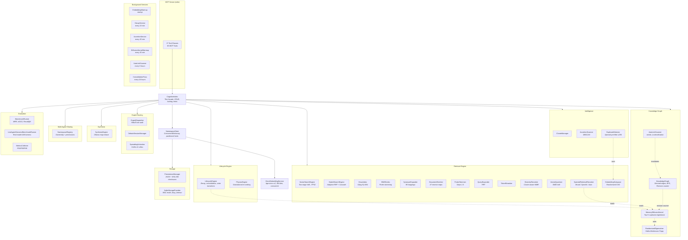

[< Back to README](../README.md)

# Architecture

The **memory-diffusion subsystem** (added in v0.9.0) is the spine of all
graph-aware behavior in the engine. `MemoryDiffusionKernel` computes the
top-K eigenbasis of each namespace's normalized Laplacian once, then
serves three downstream consumers: `LifecycleEngine` reads it to diffuse
decay debt and run consolidation passes; `SpectralRetrievalReranker`
reads it to apply low-pass / high-pass filters to relevance scores;
duplicate detection uses the parallel `EmbeddingSubspace` projector for
its own low-rank pre-filter. The `KnowledgeGraph.Revision` counter
makes cache invalidation lock-free — any edge mutation increments the
revision and the next kernel read rebuilds.

