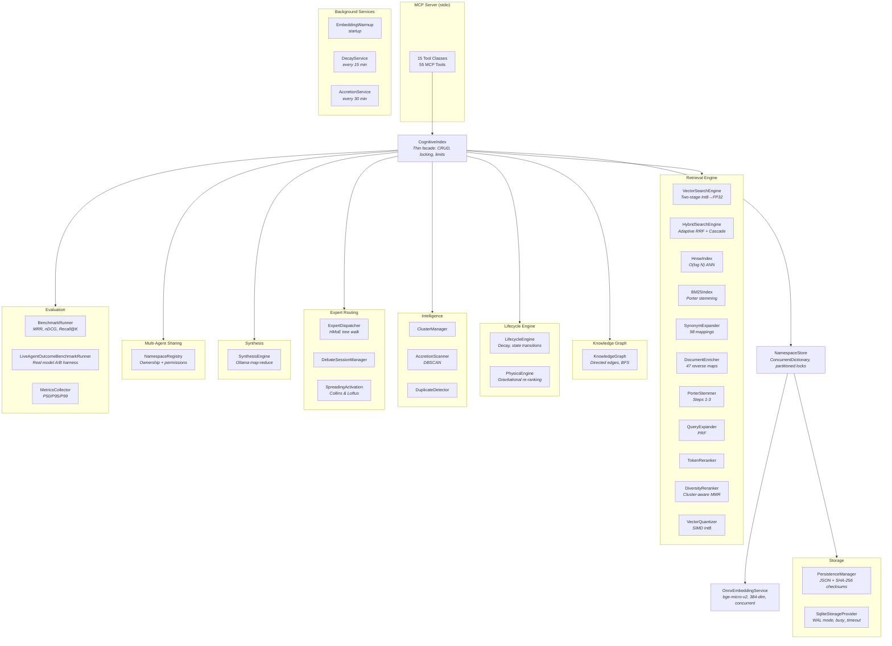

[< Back to README](../README.md)

# Architecture

```mermaid
graph TD
    subgraph MCP["MCP Server (stdio)"]
        Tools["15 Tool Classes<br/>55 MCP Tools"]
    end

    Tools --> CI["CognitiveIndex<br/><i>Thin facade: CRUD, locking, limits</i>"]

    CI --> RE["Retrieval"]
    CI --> GR["Graph"]
    CI --> LC["Lifecycle"]
    CI --> IN["Intelligence"]
    CI --> EX["Experts"]
    CI --> EV["Evaluation"]

    subgraph RE["Retrieval Engine"]
        VS["VectorSearchEngine<br/><i>Two-stage Int8→FP32</i>"]
        HS["HybridSearchEngine<br/><i>Adaptive RRF + Cascade</i>"]
        HW["HnswIndex<br/><i>O(log N) ANN</i>"]
        BM["BM25Index<br/><i>Porter stemming</i>"]
        SY["SynonymExpander<br/><i>98 mappings</i>"]
        DE["DocumentEnricher<br/><i>47 reverse maps</i>"]
        PS["PorterStemmer<br/><i>Steps 1-3</i>"]
        QE["QueryExpander<br/><i>PRF</i>"]
        TR["TokenReranker"]
        DR["DiversityReranker<br/><i>Cluster-aware MMR</i>"]
        VQ["VectorQuantizer<br/><i>SIMD Int8</i>"]
    end

    subgraph GR["Knowledge Graph"]
        KG["KnowledgeGraph<br/><i>Directed edges, BFS</i>"]
    end

    subgraph LC["Lifecycle Engine"]
        LE["LifecycleEngine<br/><i>Decay, state transitions</i>"]
        PE["PhysicsEngine<br/><i>Gravitational re-ranking</i>"]
    end

    subgraph IN["Intelligence"]
        CM["ClusterManager"]
        AS["AccretionScanner<br/><i>DBSCAN</i>"]
        DD["DuplicateDetector"]
    end

    subgraph EX["Expert Routing"]
        ED["ExpertDispatcher<br/><i>HMoE tree walk</i>"]
        DM["DebateSessionManager"]
        SA["SpreadingActivation<br/><i>Collins &amp; Loftus</i>"]
    end

    subgraph SN["Synthesis"]
        SE["SynthesisEngine<br/><i>Ollama map-reduce</i>"]
    end

    subgraph SH["Multi-Agent Sharing"]
        NR["NamespaceRegistry<br/><i>Ownership + permissions</i>"]
    end

    subgraph EV["Evaluation"]
        BR["BenchmarkRunner<br/><i>MRR, nDCG, Recall@K</i>"]
        LR["LiveAgentOutcomeBenchmarkRunner<br/><i>Real model A/B harness</i>"]
        MC["MetricsCollector<br/><i>P50/P95/P99</i>"]
    end

    CI --> SH
    CI --> SN
    CI --> NS["NamespaceStore<br/><i>ConcurrentDictionary, partitioned locks</i>"]
    NS --> SP["Storage Provider"]

    subgraph SP["Storage"]
        PM["PersistenceManager<br/><i>JSON + SHA-256 checksums</i>"]
        SQ["SqliteStorageProvider<br/><i>WAL mode, busy_timeout</i>"]
    end

    NS --> EMB["OnnxEmbeddingService<br/><i>bge-micro-v2, 384-dim, concurrent</i>"]

    subgraph BG["Background Services"]
        BG1["EmbeddingWarmup<br/><i>startup</i>"]
        BG2["DecayService<br/><i>every 15 min</i>"]
        BG3["AccretionService<br/><i>every 30 min</i>"]
    end
```

