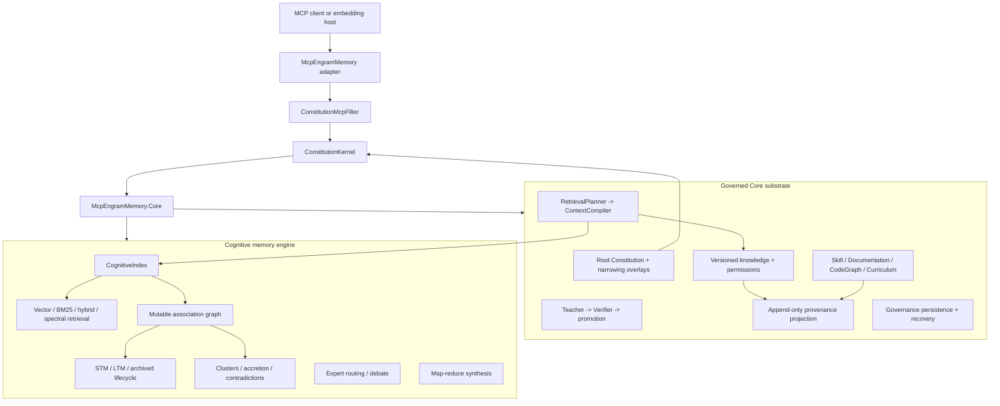
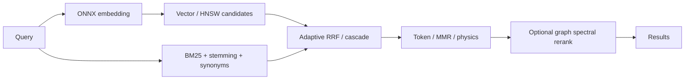

[< Back to README](../README.md)

# Architecture

Engram is a local-first cognitive memory engine with a governed Core library and an MCP stdio
adapter. `McpEngramMemory.Core` owns domain behavior; `McpEngramMemory` registers 63
tools, translates MCP calls into Core operations, supplies a host-bound principal, and applies the
global Constitution filter.

```mermaid
flowchart TB
    Client["MCP client or embedding host"] --> Adapter["McpEngramMemory adapter"]
    Adapter --> Filter["ConstitutionMcpFilter"]
    Filter --> Kernel["ConstitutionKernel"]
    Kernel --> Runtime["McpEngramMemory.Core"]

    subgraph Governed["Governed Core substrate"]
        Constitution["Root Constitution + narrowing overlays"]
        Learning["Teacher -> Verifier -> promotion"]
        Knowledge["Versioned knowledge + permissions"]
        Provenance["Append-only provenance projection"]
        Planning["RetrievalPlanner -> ContextCompiler"]
        Assets["Skill / Documentation / CodeGraph / Curriculum"]
        GovernanceStores["Governance persistence + recovery"]
    end

    subgraph Cognitive["Cognitive memory engine"]
        Index["CognitiveIndex"]
        Retrieval["Vector / BM25 / hybrid / spectral retrieval"]
        Graph["Mutable association graph"]
        Lifecycle["STM / LTM / archived lifecycle"]
        Intelligence["Clusters / accretion / contradictions"]
        Experts["Expert routing / debate"]
        Synthesis["Map-reduce synthesis"]
    end

    Runtime --> Governed
    Runtime --> Cognitive
    Constitution --> Kernel
    Knowledge --> Provenance
    Planning --> Knowledge
    Planning --> Index
    Assets --> Provenance
    Index --> Retrieval
    Index --> Graph
    Graph --> Lifecycle
    Graph --> Intelligence
```

## Core and MCP boundary

The Core library has no MCP dependency. Constitution evaluation, knowledge/version invariants,
permission intersection, provenance validation, learning, planning, semantic assets, and persistence
recovery can be used by an in-process .NET host.

The server depends on `ModelContextProtocol` 2.2.0 and uses:

- builder-based stdio transport and dependency injection;
- the global call-tool request-filter pipeline for pre/post constitutional evaluation;
- generated tool schemas;
- `ReadOnly`, `Destructive`, `Idempotent`, and `OpenWorld` annotations on every tool.

The SDK package version is not an MCP protocol revision. Protocol negotiation belongs to the SDK and
client; the server does not hard-code one revision.

The global MCP filter makes the MCP path constitutional, but direct Core callers must invoke
`ConstitutionKernel` around their own governed operations. The public MCP surface contains 63
memory-oriented tools; governed knowledge, planning, and semantic asset APIs are currently Core
composition surfaces rather than additional MCP tools.

## Constitutional execution boundary

`RootConstitution` is immutable and content-addressed. `ConstitutionComposer` combines it with
overlays that may only narrow allowed operations or strengthen safeguards. The deterministic
evaluator orders rules stably and fails closed on missing, mismatched, or throwing implementations.
`ConstitutionKernel` audits both ordinary decisions and evaluation failures.

For MCP calls, `ConstitutionMcpFilter` creates an `OperationEnvelope` containing the host-bound
principal, operation kind, purpose, canonical argument hash, and tool metadata. Precondition denial
prevents invocation. Postconditions are detection and audit after invocation; because a tool may
already have committed, a postcondition denial is recorded but does not falsely replace the
successful result without a rollback transaction.

See [Cognitive Constitution and Governed Core](cognitive-constitution.md) for the full contract and
current persistence limitations.

## Cognitive memory pipeline

`CognitiveIndex` is the thread-safe facade over tenant/namespace-partitioned entries, locking,
limits, storage, and retrieval engines.

```mermaid
flowchart LR
    Query --> Embed["ONNX embedding"]
    Embed --> Vector["Vector / HNSW candidates"]
    Query --> Lexical["BM25 + stemming + synonyms"]
    Vector --> Fusion["Adaptive RRF / cascade"]
    Lexical --> Fusion
    Fusion --> Rerank["Token / MMR / physics"]
    Rerank --> Spectral["Optional graph spectral rerank"]
    Spectral --> Results
```

Retrieval scores are relevance signals. They do not imply truth, evidence strength, authorization,
or knowledge maturity.

### Memory diffusion

`MemoryDiffusionKernel` computes a per-namespace top-K eigenbasis of the normalized graph Laplacian.
The basis serves graph-aware retrieval, lifecycle decay diffusion, and consolidation. Positive
association relations contribute to the operator; contradiction edges are excluded. A monotonic
`KnowledgeGraph.Revision` invalidates stale bases after edge mutations. Duplicate detection uses the
parallel low-rank `EmbeddingSubspace` pre-filter rather than the diffusion basis.

## Knowledge and provenance

Memory and knowledge are separate aggregates:

- `CognitiveEntry` describes experience, retrieval, salience, and STM/LTM/archive durability.
- `KnowledgeVersion` describes a versioned claim, maturity, validity, evidence, calibrated epistemic
  dimensions, exact permissions, and constitutional derivation.

The cognitive association graph is mutable, weighted, auto-linked, and keyed by bare memory IDs.
The provenance projection uses versioned `ArtifactRef` identities and append-only,
content-addressed `ProvenanceAssertion`s. It never participates in similarity auto-linking or
cognitive diffusion. Derived permissions are an intersection of exact source snapshots.

## Learning and promotion

`TeacherRuntime` emits quarantined proposals from authorized evidence. `VerifierPlanner` runs
deterministic verifiers before model and human checks. Deterministic failure is a veto, and model
verification records independence from the Teacher. `KnowledgePromotionEvaluator` checks evidence,
version freshness, constitutional outcome, human approval when required, and permission monotonicity.

`InMemoryGovernedKnowledgeStore` provides a reference atomic commit for a knowledge version, active
pointer, provenance assertion, and audit record. The opt-in file stores are individually crash-safe
but do not yet provide one cross-file transaction spanning all governed records.

## Retrieval planning and context disclosure

`RetrievalPlanner` authorizes sources and candidate references before relevance scoring.
`ContextCompiler` then re-authorizes every selected/materialized reference, preserves citations,
provenance, audit links, warnings and versions, and enforces deterministic token/byte/item budgets.
Its manifest explicitly reports complete, incomplete, or abstained disclosure. Relevance ordering is
never converted into epistemic confidence.

Profiles define an authorization ceiling; loadouts can only narrow capabilities, permission grants,
sources, and budgets. Artifact authorization is still checked at retrieval and disclosure time.

## Semantic asset families

Core provides immutable publishers and runtime contracts for Skill, Documentation, CodeGraph, and
Curriculum versions. Skills are never executed by Engram itself: after deterministic validation,
`SkillExecutionCoordinator` delegates to a host-provided `ISkillSandbox`. Curriculum compilation
accepts governed Knowledge and published Skill sources, never raw memory.

## Identity and tenant boundary

`IPrincipalContext` carries tenant, agent/principal, system status, and legacy status from the host.
The stdio server bootstraps one process-wide context from `MEMORY_TENANT_ID` and `AGENT_ID`; those
environment variables are operator inputs, not authentication.

`PrincipalContext.LegacyUnisolated` (empty tenant plus default agent) preserves historical
single-user behavior. Entry storage and lookup are tenant-aware, but the cognitive graph, clusters,
lifecycle support structures, collapse history, and diffusion caches still contain global bare IDs.
Non-empty-tenant callers therefore fail closed for affected graph/cluster/lifecycle/intelligence/
accretion/diffusion/spectral/maintenance/synthesis/visualization tools. This prevents cross-tenant disclosure
or mutation; it does **not** mean the graph is tenant-qualified.

See [Security](../SECURITY.md) and [Tenant Isolation Design](tenant-isolation-design.md).

## Storage and recovery

Legacy memory storage supports JSON, SQLite, and SQL Server providers. Governed persistence is a
separate set of focused file stores for Constitution versions/decisions/audit, knowledge aggregates,
and provenance. Snapshots use checksum-protected temp-write + flush + atomic replacement. Journals
use fsync, checksums, and monotonic sequences. Recovery may truncate a corrupt final record only;
earlier corruption, identity mismatch, schema mismatch, or invalid hashes fail closed.

The server currently registers the in-memory Constitution provider and audit store by default.
Embedding hosts that require restart-durable governance must explicitly compose the file-backed
stores and surface their recovery diagnostics.
