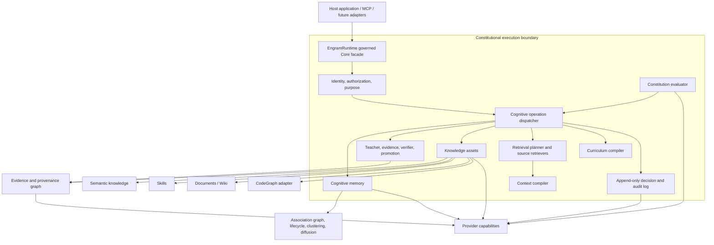

# Cognitive Constitution and Governed Knowledge Architecture Review

> **Historical design review (2026-08-11).** The capability table below records the repository
> before the governed substrate was implemented, so its `MISSING`/`PARTIAL` labels are not current
> status. The implemented Core boundary is documented in
> [Cognitive Constitution and Governed Core](cognitive-constitution.md); current tenant limitations
> are documented in [Security](../SECURITY.md). This review remains useful for rationale, threats,
> sequencing, and rejected shortcuts.

Status: proposed architecture

Review date: 2026-08-11

Engram revision reviewed: `f83a2e2` (`main`)
Comparison revision: TencentDB-Agent-Memory `4dca55c41bf11cb19b49728dbe495c8e05d25abb`

## Executive conclusion

Engram should introduce a first-class **Cognitive Constitution**, but not as another memory, a prompt fragment, or an unrestricted policy script. It should be an immutable-by-version, auditable set of machine-enforceable invariants evaluated by `McpEngramMemory.Core` around every governed cognitive operation.

That is the architectural move that connects Engram's existing cognitive behavior to a durable knowledge and learning system:

```text
Experience -> Cognitive Memory -> Teacher Proposal -> Evidence -> Verification
           -> Governed Knowledge -> Skill / Document / Code link -> Curriculum
```

The Constitution governs every arrow. It does not perform the work itself.

The repository supports the broader direction, but it also changes the sequencing:

1. **Do not begin with Teacher or new asset types.** First close existing authorization and isolation bypasses. A knowledge promotion pipeline cannot preserve source permissions if some current retrieval paths bypass source permissions.
2. **Keep `CognitiveEntry` focused on memory.** Add a separate knowledge-asset model and a universal artifact-reference/provenance model. Do not turn `CognitiveEntry` into memory + skill + document + code + policy + audit event.
3. **Keep the existing cognitive graph.** Its mutable, weighted association edges are valuable. Provenance requires a distinct logical projection because provenance edges are immutable evidence records, not associations to diffuse, decay, or auto-link. The two projections may share graph/storage primitives, identifiers, and traversal infrastructure.
4. **Separate durability, epistemic maturity, validity, and authorization.** STM/LTM describes memory durability. It must never imply truth, approval, currency, or permission.
5. **Make the Teacher propose and the Verifier challenge.** Neither may silently promote knowledge. Deterministic checks run first; model checks can add objections or evidence but cannot override a deterministic failure.
6. **Put governance and the Constitution around the architecture, not below it.** They are cross-cutting controls over memory, learning, assets, retrieval, context construction, and curriculum compilation.

TencentDB-Agent-Memory is a useful comparison because its current repository explicitly models Skills, Wiki, CodeGraph, versions, visibility, ownership, and agent bindings. Engram should adopt those durable-asset lessons without replacing its stronger behavior-centric core: lifecycle, consolidation, graph diffusion, contradiction preservation, retrieval physics, and expert routing. The resulting product is not a larger memory server. It is a local-first governed cognitive substrate.

## Review method and evidence boundaries

This review used:

- direct source inspection of `McpEngramMemory.Core`, the MCP host, the optional ONNX synthesis package, tests, benchmarks, and architecture documents;
- a clean .NET 8 test run: **1,155 passed, 0 failed, 0 skipped** using the repository's publish-style category filter;
- read-only Engram recall from the project namespace and relevant expert namespaces;
- direct inspection of TencentDB-Agent-Memory's current public repository at commit `4dca55c`.

Engram expert memories are treated as design context, not as source-of-truth. Current code wins when memory and code differ. The current Engram MCP process reports `agentId = default`, so expert namespaces are accessible shared state rather than isolated security principals.

## Current architecture: reality map

The following classifications use the requested meanings:

- **EXISTS** — implemented as a coherent current capability.
- **PARTIAL** — useful primitives exist, but the requested abstraction or guarantees do not.
- **MISSING** — no substantive implementation exists.
- **OVERLAP** — current architecture already solves part of the problem differently.
- **CONFLICT** — the naive feature shape would duplicate or damage a current mechanism.

| Capability | Status | Repository reality and implication |
|---|---|---|
| Cognitive memory record | EXISTS | `CognitiveEntry` contains identity, vector/text, namespace/tenant, string category, metadata, keywords, lifecycle, timestamps, salience, and summary fields (`Models/CognitiveEntry.cs:8-67`). |
| Typed memory kinds | PARTIAL | `Category` is an arbitrary string. There are no episodic/semantic/procedural subclasses. Keep episodic experience here; do not use subclasses to model every knowledge asset. |
| STM/LTM lifecycle | EXISTS | `stm`, `ltm`, and `archived` transitions, decay, consolidation, feedback, and resurrection exist (`Lifecycle/LifecycleEngine.cs:83-214, 377-480`). |
| Feedback | EXISTS | Feedback changes activation and lifecycle. It is relevance/salience feedback, not epistemic validation (`LifecycleEngine.cs:393-452`). |
| Confidence | PARTIAL | Retrieval and expert routing have operational confidence scores. Entries have no calibrated belief confidence. Activation and access count must not be relabeled as confidence. |
| Authority, source trust, evidence strength, consensus | MISSING | No durable, separately explainable dimensions exist. |
| Contradictions | PARTIAL | Explicit `contradicts` edges and high-similarity candidates exist, and contradiction edges are excluded from positive diffusion. There is no claim-level conflict record, temporal interpretation, or resolution state machine. |
| Cognitive graph | EXISTS | Directed, weighted, string-typed edges support traversal and activation (`Graph/KnowledgeGraph.cs`). |
| Graph diffusion | EXISTS | Namespace-scoped normalized-Laplacian diffusion with qualification thresholds, cached bases, and graceful fallback exists (`Graph/MemoryDiffusionKernel.cs`). |
| Clustering | EXISTS | Semantic clusters, centroids, members, and optional summary entries exist (`Intelligence/ClusterManager.cs`, `Models/SemanticCluster.cs`). |
| Spectral retrieval | EXISTS | Broad and specific spectral modes rerank or rescue graph-supported memories (`Retrieval/SpectralRetrievalReranker.cs`). |
| Vector and lexical retrieval | EXISTS | HNSW/vector, BM25, RRF, query expansion, PRF retry, token reranking, diversity, and score explanations exist (`CognitiveIndex.cs:393-498`, `Retrieval/HybridSearchEngine.cs:58-162`). |
| Retrieval planner | PARTIAL / OVERLAP | Planning policy exists as distributed heuristics in `CognitiveIndex`, `HybridSearchEngine`, and `CompositeTools`. Add an orchestration abstraction; do not build a competing search stack. |
| Context compiler | MISSING | Retrieval returns results directly. There is no separately governed, budgeted, citation-aware context assembly stage. |
| Expert memories / HMoE | EXISTS | Persona vectors route to `expert_{id}` namespaces. Experts retrieve evidence; they do not run independent models (`Experts/ExpertDispatcher.cs`, `Tools/CompositeTools.cs:138-243`). |
| Synthesis | EXISTS | Cluster-aware, bounded-parallel map/reduce synthesis exists (`Synthesis/SynthesisEngine.cs:56-210`). |
| Verifiable synthesis | MISSING | Prompts ask the generator to notice contradictions, but output has no required citations, claim checks, provenance record, or deterministic validation. |
| Text generator abstraction | EXISTS | `ITextGenerator` decouples synthesis from generation. Ollama is host-wired; ONNX GenAI is an optional package and host integration (`Synthesis/ITextGenerator.cs`, `McpEngramMemory.Synthesis.Onnx`). |
| Teacher | MISSING | Accretion and synthesis discover/condense patterns, but neither creates governed knowledge proposals. |
| Verifier | MISSING | Benchmarks evaluate system outputs, but there is no runtime verification protocol for proposed knowledge. |
| Semantic knowledge asset | MISSING | Durable claims remain ordinary memories or generated summaries. |
| Skill asset | MISSING | No versioned procedural aggregate, verification suite, resource manifest, or loadout binding exists. |
| Document/Wiki asset | MISSING | Text can be stored as memory, but authoritative document revisions, sections, citations, and validity are absent. |
| CodeGraph | MISSING | The existing `KnowledgeGraph` connects memories; it is not a file/symbol/call/dependency graph. |
| Curriculum | MISSING | No governed path from verified knowledge to training/evaluation artifacts exists. |
| Provenance | MISSING | User metadata and checksums are not immutable source lineage. Entries do not record actor, source artifact, derivation, model/prompt, or verification chain. |
| Temporal knowledge | PARTIAL | Memories have creation/access timestamps. Knowledge validity (`ValidFrom`, `ValidUntil`, `VerifiedAt`, `SupersededAt`) is absent. |
| Asset versioning/supersession | MISSING | Storage schemas are versioned; knowledge objects are not. No immutable version chain or active-version pointer exists. |
| Namespaces and sharing | PARTIAL | Ownership plus read/write grants exist, but authorization is coarse and several tool paths bypass it. |
| Agent identity | PARTIAL | `AGENT_ID` or `default` is an identifier, not authenticated identity (`Program.cs:127-130`). |
| Tenant isolation | PARTIAL | Core indexing and SQL Server have tenant-aware partitions. SQLite and several namespace-wide operations are not fully tenant scoped. MCP memory writes do not bind a tenant to a verified principal. |
| Agent profile/loadout | MISSING | Expert routing narrows a memory namespace, but there is no explicit role, capability, asset, tool, budget, or policy bundle. |
| Storage abstraction | EXISTS / PARTIAL | `IStorageProvider` supports cognitive entries, graph, clusters, lifecycle config, and HNSW. It should not absorb every future asset type. |
| JSON, SQLite, SQL Server | EXISTS | All are current persistence choices, with provider-specific schema/version behavior. |
| General import/export | MISSING | Migration utilities and visualization snapshots exist; a governed, versioned, portable asset import/export contract does not. |
| MCP tool surface | EXISTS | Tools are profile-gated (`minimal`, `standard`, `full`) in `Program.cs:141-180`. Governance enforcement itself must never depend on an optional tool profile. |
| Embeddable Core | EXISTS | Core services are public and usable in process. Composition is service-oriented, though no single governed façade defines the safe path. |
| Tests and benchmarks | EXISTS | Extensive unit/integration, isolation, lifecycle, retrieval, outcome, and scaling tests exist. Constitution compliance, provenance, permission inheritance, promotion, and verifier-independence suites do not. |
| Cognitive Constitution | MISSING | No model, store, evaluator, operation envelope, policy decision, immutable version, or constitutional audit trail exists. Prompt text is not a constitution. |

## Phase 0: security and correctness prerequisites

The Constitution's most important early job is to turn existing intended boundaries into verified invariants. Source inspection found four priority issues. They are not reasons to abandon the architecture; they determine the first milestone.

### 1. Some MCP reads and statistics bypass complete authorization

`get_context_block` reads an arbitrary namespace without a `CanRead` check (`Tools/CompositeTools.cs:337-373`). The expert-routed branch of `recall` searches the selected expert namespace without checking the caller's access (`CompositeTools.cs:210-226`). Graph expansion also needs authorization at every traversed artifact, not only at the initial seed (`CompositeTools.cs:375-400`). `get_memory` authorizes the requested entry but returns its edges without filtering inaccessible endpoints (`Tools/AdminTools.cs:53-76`).

`cognitive_stats` computes lifecycle counts for an arbitrary requested namespace and returns store-wide edge/cluster counts before limiting the namespace-name list (`Tools/AdminTools.cs:81-105`). Aggregate counts can still reveal existence or activity. Their disclosure needs an explicit policy rather than an assumption that aggregates are harmless.

Constitutional invariant:

> Every artifact entering a result or context must be authorized for the requesting principal and purpose, regardless of the path by which it was discovered.

This check belongs in Core retrieval/context boundaries, not only individual MCP tools, because an in-process consumer can bypass MCP.

### 2. Debate materialization can create an open derived-data namespace

`consult_expert_panel` materializes retrieved expert text into `active-debate-{sessionId}` without establishing an owner or derived permission label. Under the current “unregistered namespaces are open” rule, another identified agent can retrieve the copied content. Debate map/resolve operations also need session-owner authorization (`Tools/DebateTools.cs:61-125, 137-242`; `Experts/DebateSessionManager.cs:72-75`).

This is already a derived-data permission-inheritance failure in miniature. Fix it before using debate or Teacher output as the basis for a general knowledge pipeline.

### 3. Administrative deletion is broader than ownership

`purge_debates(dryRun: false)` can enumerate and delete matching namespaces without an identity/authorization decision (`Tools/AdminTools.cs:120-175`). Existing hard deletes also remove entries and graph relationships, which conflicts with “never destroy provenance” once an entry supports knowledge.

Constitutional invariant:

> Governed artifacts are retired by tombstone or supersession. Physical purge is a separate break-glass operation requiring explicit authority, retention-policy proof, and an append-only audit event.

### 4. `AGENT_ID` is not authentication, and system namespaces are globally readable

The default identity bypasses ACL checks, unregistered namespaces are open, and first identified writes can establish ownership (`Sharing/NamespaceRegistry.cs:92-105, 167-227`). In addition, every namespace beginning `_` is treated as readable by every identity (`NamespaceRegistry.cs:98-100`), while `_system_sharing` contains owner and grant data (`NamespaceRegistry.cs:230-253`). This preserves legacy usability, but it cannot be represented as a secure multi-agent boundary.

Introduce `IPrincipalContext` with verified claims supplied by the host. For in-process use, the embedding application is the trust boundary. For MCP, transport/session authentication must bind claims to the request. `default` remains an explicitly named **legacy-unisolated mode**, never a silent production security mode.

### 5. Tenant semantics are inconsistent across providers and broad operations

The in-memory index and SQL Server support tenant scoping, but SQLite retains `(ns,id)` storage semantics and namespace deletion remains broad in important paths. The MCP write surface does not bind tenant identity to the caller. Before derived knowledge exists, all create/read/update/delete, graph, cluster, background-worker, and admin operations need the same `(tenant, namespace, artifact)` scope.

Required Phase 0 tests include cross-tenant identical IDs, namespace deletion, graph traversal, `get_memory` edge projection, context blocks, expert routing, debate sessions, archived recall, aggregate statistics, background consolidation, system namespaces, and non-disclosure of artifact existence or counts.

## Target architecture

The prompt's candidate layers are directionally right, but governance and the Constitution should wrap the system rather than sit between assets and retrieval.



### Boundary rule

`McpEngramMemory.Core` remains the architecture. MCP remains an adapter. A governed operation must produce the same decision and audit record whether invoked through MCP or directly in a .NET process.

### Compatibility rule

Existing public services remain available during migration, but only operations through the new governed façade may claim constitutional enforcement. Direct mutation through `CognitiveIndex` is a legacy/low-level API until a major version can restrict it. The façade should expose narrow services rather than become a new god object.

## The Cognitive Constitution

### What it is

A Constitution is an immutable-versioned bundle of principles and executable rules that constrains cognitive operations. It contains human-readable meaning and machine-checkable enforcement metadata.

It is not:

- a `CognitiveEntry`;
- a Skill;
- a system prompt;
- a model persona;
- an arbitrary user-authored script;
- a single global ranking score;
- a replacement for authentication or storage isolation.

### Immutability model

“Immutable” should mean **published versions are immutable**, not that the project can never improve a principle.

- A built-in Root Constitution defines non-overridable invariants.
- An organization can publish a signed/hashed overlay that tightens the root rules.
- Teams and applications can add narrower overlays.
- An overlay cannot weaken a parent deny, widen readers, remove required evidence, or disable audit.
- A new version supersedes an old one; the old version remains available so historical decisions can be reproduced.
- Every decision records the exact constitution and overlay version hashes.

This forms a monotone policy hierarchy: children may constrain, never broaden.

### Suggested Core contracts

```csharp
public sealed record CognitiveOperation(
    string OperationId,
    CognitiveOperationKind Kind,
    PrincipalContext Principal,
    string Purpose,
    IReadOnlyList<ArtifactRef> Inputs,
    ArtifactRef? Target,
    object Payload,
    DateTimeOffset RequestedAt);

public interface IConstitutionEvaluator
{
    ValueTask<ConstitutionDecision> EvaluateAsync(
        CognitiveOperation operation,
        ConstitutionPhase phase,
        CancellationToken cancellationToken = default);
}

public interface IConstitutionRule
{
    string RuleId { get; }
    IReadOnlySet<CognitiveOperationKind> AppliesTo { get; }
    ValueTask<IReadOnlyList<ConstitutionFinding>> EvaluateAsync(
        ConstitutionalContext context,
        CancellationToken cancellationToken);
}

public sealed record ConstitutionDecision(
    string ConstitutionVersion,
    ConstitutionOutcome Outcome, // Allow, Deny, Quarantine, RequireApproval
    IReadOnlyList<ConstitutionFinding> Findings,
    IReadOnlyList<ArtifactRef> Evidence,
    string AuditEventId);
```

Rules should be deterministic .NET implementations first. A small declarative policy format can compose approved predicates, but unrestricted code execution does not belong in a Constitution. Model-based critics are registered as verifiers and may recommend denial/quarantine; they may not convert a deterministic denial into allow.

### Operation phases

Every governed operation follows the same shape:

```text
Authorize principal and purpose
  -> Precondition rules
  -> Execute or stage candidate
  -> Postcondition rules
  -> Commit / quarantine / deny
  -> Append audit event
```

Checks must occur both before and after operations because some invariants concern the output: permission inheritance, citation completeness, redaction, context contents, and generated claims.

The evaluator should be invoked around commands, not inside `CognitiveIndex` write locks. Existing `EntryUpserted` events are useful for asynchronous observation, but an event fired after commit cannot enforce a precondition.

An allow decision also needs a commit-time concurrency contract. The precondition captures the authorization, Constitution overlay, source versions, and active-target version it evaluated. Commit then performs compare-and-commit against that snapshot or re-evaluates inside the storage transaction. If any relevant version changed, the operation retries or fails. This prevents an ACL, policy, or active-version change between evaluation and mutation from invalidating the decision.

### Root principles and enforceable meaning

| Principle | Deterministic enforcement |
|---|---|
| Never destroy provenance | Evidence and audit edges are append-only. Governed delete creates a tombstone. Physical purge requires break-glass policy and records what was purged, why, by whom, and under which retention rule. |
| Knowledge requires evidence | Promotion requires a non-empty evidence set; every referenced artifact must exist, be authorized for the promotion service, and have a stable version/hash. |
| Memory is not truth | Lifecycle transitions cannot update knowledge maturity. No rule may infer Verified/Established from LTM, access count, activation, similarity, or retrieval rank. |
| Preserve contradictions until resolved | Conflicts become durable `ConflictRecord`s. Resolution adds a disposition; it does not delete either side. |
| Derived knowledge cannot broaden permissions | Compute effective authorization from the intersection of every supporting artifact's reader/use sets. Broader publication requires an explicit declassification/redaction workflow. |
| Deterministic verification precedes model verification | Verifier plans are ordered. A model verifier cannot run first when an applicable deterministic verifier exists, and cannot override its failure. |
| Promoted knowledge remains explainable | Promotion requires a complete derivation chain, verifier runs, constitution version, and reproducible artifact versions. |
| Learning actions are auditable | Teacher proposal, verifier decision, human approval, promotion, supersession, loadout binding, retrieval rationale, context emission, and curriculum export emit immutable audit events. |
| Authorization precedes relevance | Permission and purpose filters run before candidate generation where possible and always before emission. Relevance scores never override authorization. |
| Models propose; Engram governs | Generated output enters a proposal/quarantine state. No `ITextGenerator` response directly mutates established knowledge. |

### Failure behavior

The engine should not use one universal fail-open/fail-closed rule:

- **Fail closed:** permission evaluation, promotion, verification, declassification, curriculum export, destructive purge, and established-knowledge mutation.
- **Quarantine:** Teacher output, imported assets with incomplete provenance, and memory writes when auditing is temporarily degraded.
- **Fail safe with reduced capability:** ordinary retrieval may fall back to already-authorized local sources if a planner/model is unavailable.
- **Never require a model:** authorization, provenance integrity, lifecycle, evidence existence, version checks, deterministic verifier ordering, and storage commits.

## Data model: separate the state machines

### Cognitive memory durability

Keep the current lifecycle, with clearer names/documentation if desired:

```text
STM -> LTM -> Archived
  ^             |
  +-- resurrect-+
```

This answers: **How durable and retrievable is the experience?**

### Knowledge maturity

The proposed `Observed -> Hypothesized -> Supported -> Verified -> Established` sequence mixes evidence origin with epistemic status. “Observed” is better modeled as an evidence kind. Recommended maturity:

```text
Proposed -> Hypothesized -> Supported -> Verified -> Established
```

Use separate orthogonal status:

```text
Active | Disputed | Superseded | Withdrawn
```

This prevents awkward states such as “Superseded” being both maturity and validity. A Verified claim can become Disputed without pretending it was never verified. An Established claim can be Superseded while remaining historically reproducible.

### Temporal validity

Knowledge and asset versions need:

- `CreatedAt`
- `ObservedAt` on evidence
- `ValidFrom` / `ValidUntil`
- `VerifiedAt`
- `SupersededAt`
- transaction time (when Engram recorded the fact)

Valid time and transaction time should remain distinct. That enables both “what was true on March 1?” and “what did this agent know on March 1?”

### Epistemic dimensions

Do not create one opaque `TruthScore`.

- **Confidence:** calibrated degree of belief for a specific claim/version.
- **Authority:** policy-defined standing of a source for a domain and time.
- **Trust:** empirically observed reliability of a source/model over resolved outcomes.
- **Evidence strength:** coverage, independence, directness, and verifier results.
- **Freshness:** time since observation/verification relative to a domain policy.
- **Consensus:** independent supporting sources, not duplicate memories from one source.

Store the facts from which these are computed and expose a score breakdown. Authorization and validity are hard gates. Maturity transitions are rules. Ranking may use the remaining components, but it must return the contribution of each component instead of presenting an unexplained scalar as truth.

## Universal artifacts and provenance

### Artifact references

All cross-subsystem relationships should use a scoped reference:

```csharp
public sealed record ArtifactRef(
    string TenantId,
    string Namespace,
    ArtifactKind Kind,
    string ArtifactId,
    string Version);
```

Current memory graph edges use bare IDs. That is insufficient for cross-tenant, cross-namespace, cross-type provenance and is one reason the existing graph should not simply receive more relation strings.

### Two graph projections, shared infrastructure

**Cognitive association graph**

- mutable and heuristic;
- weighted;
- auto-linked;
- supports spreading activation, clustering, and diffusion;
- may be pruned or recomputed;
- contradiction edges are excluded from positive diffusion.

**Provenance/evidence graph**

- append-only except retention-governed tombstones;
- typed and versioned;
- records actor, operation, time, verifier, model/prompt/tool, and source versions;
- never auto-linked by similarity;
- never participates in cognitive diffusion;
- authorization labels are part of every traversable record.

They should share `ArtifactRef`, storage codecs, traversal primitives, visualization contracts, and possibly physical edge tables. They should not share lifecycle or inference semantics.

Core evidence relations include:

```text
DERIVED_FROM, SUPPORTED_BY, CONTRADICTED_BY, VERIFIED_BY,
GENERATED_BY, OBSERVED_BY, APPROVED_BY, SUPERSEDES, TESTED_BY
```

Every derivation is a first-class record, not merely an edge:

- inputs and exact versions;
- transformation/rule/model and version;
- output and version;
- actor and purpose;
- timestamp;
- constitution decision;
- effective permission label;
- reproducibility metadata.

## Permission inheritance and declassification

Visibility enums alone cannot solve derivation leakage. Two `restricted` sources may authorize different people.

For derived artifact `D` supported by sources `S1..Sn`:

```text
D.effectiveReaders = intersection(S1.readers ... Sn.readers)
D.effectiveUse     = intersection(S1.use ... Sn.use)
D.trainingUse      = intersection(S1.trainingUse ... Sn.trainingUse)
```

The result may be empty. That is valid: the system may retain the knowledge for audit while exposing it to nobody except an authorized governance service.

Important rules:

1. A loadout can only narrow authorization; it cannot grant it.
2. A citation is re-authorized for the current caller at context-compilation time.
3. Search must not reveal the existence, score, title, or count of inaccessible artifacts.
4. Summary text is still derived data. It inherits restrictions even if it omits obvious identifiers.
5. Broader publication requires a `DeclassificationProposal` with redaction/sanitization evidence, an authorized approver, deterministic leakage checks where possible, and a new derivation branch. The restricted original remains intact.
6. `READ`, `SEARCH`, `USE`, `TRAIN`, `MODIFY`, `PROMOTE`, `VERIFY`, `DECLASSIFY`, and `ADMINISTER` are distinct capabilities.

## Teacher, Verifier, and promotion

### Teacher Runtime

The Teacher is an asynchronous, budgeted proposal engine. It consumes authorized artifacts and emits immutable `KnowledgeProposal`s or `SkillProposal`s containing:

- claim/procedure;
- supporting and contradicting artifact references;
- hypothesis type;
- generating model/runtime and version;
- prompt/template version;
- proposed validity interval;
- uncertainty and known gaps;
- exact constitution version;
- inherited permission label.

The Teacher never writes established knowledge and never uses its own proposal as independent evidence. Proposal namespaces/indexes must be excluded from ordinary evidence retrieval unless the verifier explicitly asks for candidates.

### Verifier pipeline

Verifier planning is capability-driven:

1. schema and required-field checks;
2. evidence existence, version, authorization, and independence checks;
3. temporal consistency and supersession checks;
4. deterministic domain checks;
5. model critic(s), if useful;
6. human approval, if policy requires;
7. constitutional promotion decision.

Examples of deterministic verifiers:

- code claim -> build, compile, static analysis, or test;
- SQL claim -> parse and execute against an isolated fixture;
- API/schema claim -> validate against a versioned schema;
- procedure -> run in a sandbox or simulate against fixtures;
- citation -> verify referenced artifact/version and claim span;
- permissions -> verify non-broadening lattice rule;
- provenance -> verify the derivation DAG reaches allowed source kinds;
- temporal claim -> detect overlapping incompatible validity intervals.

A model verifier must record its independence from the Teacher. For promotion above `Supported`, the same model + same prompt family + same evidence view is not independent verification. It may still provide advisory critique.

### Promotion

Promotion is a transaction:

```text
Freeze proposal inputs
-> run verifier plan
-> evaluate Constitution
-> write knowledge version + evidence records + audit event
-> atomically update active-version pointer
```

If any write fails, no partially promoted asset becomes active. The proposal and verifier runs remain for diagnosis.

## Knowledge assets

### Semantic knowledge

A semantic knowledge asset is a versioned claim or small coherent claim set with maturity, validity, evidence, conflicts, authority context, permissions, and explanation. It should not decay like episodic memory. Retrieval freshness and periodic re-verification replace memory decay.

### Skill

A Skill is versioned procedural knowledge, not a long memory. Suggested aggregate:

- identity, name, purpose, description;
- parameters and preconditions;
- ordered steps;
- expected outcomes and invariants;
- failure conditions and rollback guidance;
- resource manifest;
- examples/counterexamples;
- evidence and provenance;
- verification suite and last verification result;
- applicability/loadout constraints;
- version, status, validity, and permissions;
- execution outcomes and drift signals.

Core should define the Skill and verification contracts. Actual execution belongs behind an `ISkillExecutor` supplied by a host/sandbox. Engram should not become an unrestricted script runner.

### Document / Wiki

Treat source revisions, sections, fragments, citations, authority, effective dates, and supersession as durable records. Retrieval returns relevant fragments; provenance points to immutable source revisions. Generated Wiki pages remain derived assets and must not silently become authoritative merely because they are polished.

### CodeGraph

Build CodeGraph as an optional subsystem/package with its own incremental store and retriever. Start with Roslyn for C# because it provides compiler-grade symbols and relationships. Add tree-sitter adapters later for Python/JavaScript/TypeScript when the common graph contract is stable.

Track repository, commit, file hash, language, symbol identity, and edge origin. Incremental indexing invalidates changed files and their dependent relationships. Cross-link code artifacts to memory/knowledge with `ArtifactRef`:

```text
IncidentMemory --CAUSED_BY--> Method@commit
ArchitectureKnowledge --IMPLEMENTED_BY--> Type@commit
SkillVersion --USES--> Script@commit
TestRun --VERIFIES--> ClaimVersion
```

Do not store source files or every symbol as `CognitiveEntry`. CodeGraph content is a retrieval source; selected code events may create cognitive memories.

### Curriculum

Curriculum compilation is a separate governed export pipeline. Inputs must be Verified/Established knowledge or verified Skill versions, plus explicit training-use permission. Outputs carry source lineage, license/consent policy, redaction results, compiler version, validation results, and dataset version.

Raw memory never flows directly into training data.

## Retrieval planner and context compiler

### Planner

Preserve existing retrieval engines behind source adapters:

```csharp
public interface IArtifactRetriever
{
    ArtifactKind Kind { get; }
    ValueTask<IReadOnlyList<RetrievalCandidate>> RetrieveAsync(
        RetrievalSubplan plan,
        CancellationToken cancellationToken);
}
```

The planner determines authorized sources, intent, budgets, active versions, validity policy, and retrieval modes. A deterministic planner must cover normal operation; a local or external model may refine intent but cannot widen authorization or be required for ordinary memory recall.

Candidate processing should be staged and explainable:

1. authenticated principal, purpose, tenant, and loadout;
2. permission and Constitution hard filters;
3. active-version and temporal-validity filters;
4. source-specific retrieval (current vector/BM25/graph/spectral/expert engines remain intact);
5. normalized source-level relevance;
6. transparent fusion with score components;
7. conflict/provenance annotations;
8. context compilation.

### Context compiler

The compiler decides what the model actually receives. It can choose full memory, summary, document fragment, skill steps, code neighborhood, citations, and contradiction warnings within a token/time budget.

It must:

- re-authorize every emitted fragment and citation;
- include version and temporal context;
- preserve warnings for disputed or superseded knowledge;
- include enough provenance to explain claims;
- prefer source text over generated summaries when exact wording matters;
- report omissions caused by budget or policy;
- produce a machine-readable `ContextManifest` and audit event.

Retrieval finds candidates. Context compilation performs governed disclosure. Keeping them separate avoids embedding authorization and token-budget decisions inside ranking math.

## Governance and agent loadouts

### Principal and hierarchy

Recommended scope:

```text
Tenant/Organization -> Team -> User/Service -> Agent -> Namespace -> Artifact version
```

This is not necessarily one inheritance tree. Users and agents are principals; teams and organizations are groups/scopes; namespaces and assets are resources. Model it as claims and grants rather than forcing everything into parent-child ownership.

### Agent Profile and Loadout

An Agent Profile describes identity and operating constraints. A versioned Loadout binds a subset of already-authorized assets/capabilities:

- namespace and asset selectors;
- Skills and expert domains;
- tool capabilities;
- retrieval/context policies and budgets;
- memory-write policy;
- maximum knowledge authority;
- allowed verifier/executor capabilities;
- Constitution overlay versions.

Loadout binding is audited. Revocation affects future retrieval immediately without deleting historical audit records.

## Storage evolution

Do not keep expanding `IStorageProvider`. It already mixes entries, graph, clusters, collapse history, lifecycle config, and HNSW snapshots. Add focused capability interfaces:

- `ICognitiveMemoryStore`
- `IKnowledgeAssetStore`
- `IProvenanceStore`
- `IConstitutionStore`
- `IAuditEventStore`
- `IAuthorizationStore`
- `ICodeGraphStore` (optional package)

Existing providers can implement multiple capabilities. A composition layer coordinates transactions where supported. SQLite and SQL Server should use append-only version/evidence/audit tables plus active-version pointers. JSON mode should use sidecar append logs and atomic snapshot replacement, with clear guarantees that differ from transactional databases.

Constitution bundles should be cached in memory and addressed by content hash so governance does not add a database round trip to every operation. Audit writes can be batched for read-only low-risk actions, but denial/promotion/declassification/destructive decisions must be durable before success is returned.

## Backward compatibility

Recommended additive strategy:

1. Leave `CognitiveEntry` serialization unchanged except optional additive fields only when unavoidable.
2. Introduce new models/tables/files for artifacts, provenance, audit, and Constitution versions.
3. Keep existing MCP tool names and response contracts.
4. Apply authorization bug fixes to existing tools as correctness/security fixes.
5. Add new `knowledge_*`, `skill_*`, `verify_*`, `context_*`, and governance-admin tools behind appropriate profiles; enforcement is always active once enabled, regardless of profile.
6. Add `EngramRuntime`/builder APIs in Core. Mark direct mutation APIs as low-level/legacy before considering visibility changes in a future major version.
7. Start Constitution mode as `Audit` for existing installations, emit incompatibility findings, then let operators opt into `Enforce`. New governed deployments default to `Enforce`. Never label `Disabled` or default-identity mode constitution-compliant.
8. Preserve historical retrieval behavior with ablation/regression gates. Permission and validity filters happen around the candidate set; existing vector/BM25/RRF/spectral math remains comparable.

## Performance and reliability

### Keep the read path model-free

Normal memory retrieval remains embedding/lexical/graph computation. Constitution evaluation uses cached deterministic rules. Planner models and verifier models are optional, asynchronous, or proposal-time operations.

### Bound background learning

Teacher and re-verification work needs:

- per-tenant queues;
- concurrency and token budgets;
- deduplication by input-version set;
- idempotent operation IDs;
- checkpoints and resumable verifier runs;
- circuit breakers for model/tool backends;
- priority for stale/high-impact/disputed knowledge;
- observable queue age and failure counts.

### Control graph growth

- Association edges keep current similarity thresholds and scan caps.
- Provenance edges exist only for real transformations/evidence, never similarity.
- CodeGraph edges are partitioned by repository/version and incrementally compacted.
- Retrieval uses bounded neighborhoods and source budgets.
- Superseded versions move out of default indexes but remain directly addressable.

### Transaction boundaries

Promotion, supersession, permission changes, declassification, and loadout bindings require atomic state + audit semantics. Providers that cannot supply the guarantee must expose weaker capability and refuse operations whose Constitution requires atomicity.

More generally, every governed mutation needs a decision snapshot containing the relevant policy/ACL/input/target versions. The commit transaction must compare that snapshot or re-evaluate the affected rules. A valid pre-check is not sufficient if the facts it authorized can change before commit.

## Failure-mode safeguards

| Failure mode | Required safeguard |
|---|---|
| Self-reinforcing hallucination | Proposals are not evidence; generated assets retain `GENERATED_BY`; evidence independence is computed from root sources; promotion requires non-generated support or an explicit low-assurance policy. |
| Knowledge poisoning | Source trust is outcome-calibrated, duplicate roots count once, anomalies/quarantine are retained, and high-impact promotions require independent verification. |
| Authority capture | Authority is domain/time scoped, never absolute; conflicting evidence remains visible; no single source can erase conflicts. |
| Stale knowledge | Validity intervals, freshness policy, re-verification schedules, source-change events, and default exclusion of expired/superseded versions. |
| Skill drift | Execution outcomes and verification suites trigger maturity downgrade/quarantine; loadouts pin or follow explicit version policies. |
| Agent contamination | Verified identity, tenant isolation, namespace/asset ACLs, loadouts that only narrow, and no default-agent production mode. |
| Permission leakage | Source ACL intersection, per-fragment authorization, provenance-aware declassification, and non-disclosure tests across every retrieval path. |
| Model capture | Record model/prompt versions, require independence for stronger maturity, diversify verifier mechanisms, and track calibration by model/domain. |
| Graph explosion | Separate association/provenance/code projections, typed edge budgets, bounded traversals, and per-projection compaction policy. |
| Over-consolidation | Consolidation never deletes source memories; minority/exception evidence stays addressable; summaries link to all inputs and inherit their restrictions. |
| Constitution capture | Root invariants are code-owned and versioned; overlays only tighten; changes require review/signature and never rewrite past decisions. |
| Policy engine outage | Cached bundles, fail-closed high-risk actions, quarantine for ingest, and explicit degraded-mode telemetry. |

## Testing strategy

### Constitution conformance suite

Every root principle gets positive, negative, bypass, persistence, and replay tests. A golden operation log should reproduce identical decisions from the same Constitution and artifact versions.

### Authorization non-interference matrix

Test every path with two tenants, teams, users, agents, overlapping IDs, and differently restricted evidence:

- direct get/search;
- hybrid/deep/spectral recall;
- expert routing and broadcast fallback;
- graph expansion and cluster summaries;
- context blocks and context compiler;
- background decay/consolidation/accretion/auto-link;
- synthesis and Teacher/Verifier;
- import/export and curriculum;
- admin delete/purge;
- system namespaces and aggregate statistics.

Assertions include both content non-leakage and existence/count/score non-disclosure.

### Provenance property tests

- every promoted asset reaches at least one root evidence artifact;
- every edge references existing immutable versions;
- no cycle is introduced where the derived artifact becomes its own root support;
- tombstones preserve traceability;
- replay uses exact Constitution/verifier/model/tool versions;
- permission label never broadens absent a declassification record.

### Teacher/Verifier adversarial tests

- same-model agreement does not count as independence;
- proposal recycling does not increase evidence strength;
- repeated copies from one source count once;
- deterministic verifier failure cannot be overridden;
- canary false statements are rejected;
- temporal contradictions resolve as context-dependent when appropriate;
- unavailable verifier leaves proposal quarantined, not promoted.

### Compatibility and performance gates

- deserialize all historical `CognitiveEntry` fixtures;
- migrate each storage provider from every supported schema version;
- keep existing MCP contract snapshots;
- compare current retrieval benchmark arms before/after governance filters;
- measure Constitution evaluation p50/p95, audit throughput, promotion latency, graph/storage growth, and context compiler latency;
- run crash/recovery tests at every promotion transaction step.

## Recommended roadmap

### Phase 0 — make current boundaries true

- close ACL gaps in `get_context_block`, expert routing, and graph expansion;
- filter `get_memory` edge endpoints and policy-gate aggregate statistics;
- make debate sessions owned, permission-inheriting resources and authorize map/resolve;
- authorize debate purge and every namespace-wide admin action;
- protect system-sharing metadata;
- finish tenant scoping across providers and broad operations;
- introduce verified principal context and label default mode as unisolated;
- add the non-interference test matrix.

Exit criterion: no known path returns, mutates, counts, traverses, or deletes an unauthorized artifact.

### Phase 1 — Constitution and audit kernel

- publish Root Constitution v1;
- add immutable bundle/store/hash and overlay monotonicity checks;
- add operation envelope, deterministic evaluator, findings, audit log, and audit-mode integration;
- wrap current memory write/read/lifecycle/graph/synthesis/admin operations;
- expose decision explanations and conformance metrics.

Exit criterion: every governed Core operation records a reproducible constitutional decision with negligible model-free read overhead.

### Phase 2 — provenance and semantic knowledge

- introduce `ArtifactRef`, evidence/derivation records, temporal validity, conflict records, and permission inheritance;
- add Teacher proposal quarantine, deterministic verifier registry, verification runs, and atomic promotion;
- add semantic knowledge versions without changing `CognitiveEntry` lifecycle semantics.

Exit criterion: Engram can answer “why is this believed, who may use it, when was it valid, and how was it verified?”

### Phase 3 — governed retrieval and agents

- introduce source retrievers, planner, transparent fusion, and Context Compiler;
- add Principal/Profile/Loadout and richer capabilities;
- preserve existing memory retrieval as the first source adapter;
- add provenance/citation/conflict-aware context manifests.

Exit criterion: context is purpose-limited, budgeted, explainable, and authorized per fragment.

### Phase 4 — durable asset families

- implement Skill and Document/Wiki assets;
- add optional Roslyn CodeGraph package and cross-links;
- add import/export with version, provenance, license, and permission preservation;
- add drift/re-verification workflows.

Exit criterion: assets have independent lifecycle/version semantics and can be safely bound to agent loadouts.

### Phase 5 — Teacher at scale and Curriculum

- schedule budgeted pattern/skill/claim discovery;
- add deterministic execution verifiers and independent model/human policies;
- implement Curriculum Compiler with training-use permission and dataset lineage;
- benchmark end-to-end learning quality, not merely retrieval.

Exit criterion: no raw memory or unverified model output can become established knowledge or training material without a complete governed trace.

## Decisions to make before implementation

1. What are the exact non-overridable Root Constitution principles for v1?
2. Which existing Core APIs are considered governed, low-level, or legacy?
3. What authenticated principal mechanism will each host mode provide?
4. Is JSON mode allowed to refuse operations that require cross-record atomicity?
5. What minimum evidence and verifier independence are required for each maturity transition?
6. Which capabilities permit declassification and training use?
7. Which domains need authority registries and freshness policies first?
8. Is CodeGraph a repository package maintained here or an adapter contract implemented elsewhere?

## Final recommendation

Adopt the Cognitive Constitution as the architectural spine of the next generation, with one refinement: **the Constitution should govern operations, not merely describe values**.

The near-term differentiator is not the number of new asset types. It is the ability to prove that:

- a memory was not mistaken for truth;
- a proposal could not promote itself;
- a deterministic failure could not be talked away by a model;
- a contradiction was preserved;
- a derived asset did not leak its sources;
- a result was authorized regardless of its retrieval path;
- a historical decision can be replayed under the Constitution that made it;
- training material came only from verified, permitted, fully traced knowledge.

That is the coherent bridge from cognitive memory engine to governed cognitive operating system.

## Evidence appendix

### Current Engram source anchors

- `src/McpEngramMemory.Core/Models/CognitiveEntry.cs:8-67` — current memory aggregate.
- `src/McpEngramMemory.Core/Services/Lifecycle/LifecycleEngine.cs:83-214, 236-263, 377-480` — durability, consolidation, feedback, resurrection.
- `src/McpEngramMemory.Core/Services/CognitiveIndex.cs:156-265, 393-498, 547-688` — writes and retrieval pipeline.
- `src/McpEngramMemory.Core/Services/Retrieval/HybridSearchEngine.cs:58-162` — hybrid confidence/RRF policy.
- `src/McpEngramMemory.Core/Services/Graph/KnowledgeGraph.cs` — current association graph.
- `src/McpEngramMemory.Core/Services/Graph/MemoryDiffusionKernel.cs` — spectral graph behavior.
- `src/McpEngramMemory.Core/Services/Experts/ExpertDispatcher.cs` — expert namespace routing.
- `src/McpEngramMemory.Core/Services/Synthesis/SynthesisEngine.cs:56-253` — map/reduce generation and prompts.
- `src/McpEngramMemory.Core/Services/Sharing/NamespaceRegistry.cs:41-105, 167-253` — ownership/grants and legacy behavior.
- `src/McpEngramMemory/Tools/CompositeTools.cs:138-243, 337-400` — recall/context paths.
- `src/McpEngramMemory/Program.cs:45-180` — provider composition, identity, workers, tool profiles.
- `src/McpEngramMemory.Core/Services/Storage/IStorageProvider.cs` — current persistence contract.

### Engram memory evidence consulted

Project and expert recall included:

- `decision-2026-04-21-v0.8.0-scope` and related namespace-isolation decisions;
- `expert_engram_lifecycle_architect`: `lifecycle-state-machine`, `feedback-loop-mechanics`, `quantization-on-transition`, `seed-killer-demo-temporal-contradiction`, `lifecycle-benchmark-gap`;
- `expert_engram_retrieval_scorer`: `pipeline-tuning-2026-03-25` plus archived scorer history;
- `expert_distributed_synthesis_architect`: `hallucination-detection-map-reduce`, `synthesize-memories-tool-api`, `map-reduce-memory-synthesis-pattern`;
- `expert_epistemic_integrity_architect`: `hybrid-tms-architecture-design`, `ros-truth-triangle`, `layer-integration-with-existing-processes`;
- `expert_truth_provenance_architect`: `atms-justification-chains`, `source-tracking-patterns`;
- `expert_learning_verification_engineer`: `7life-verification-techniques-reference`.

Several expert memories describe other projects (especially SevenLife/RSRM). They informed terminology and failure analysis but were not treated as evidence of Engram implementation. The `expert_cognitive_memory_specialist` lookup returned no results.

### External comparison

- [TencentDB-Agent-Memory repository](https://github.com/TencentCloud/TencentDB-Agent-Memory)
- [Reviewed comparison commit](https://github.com/TencentCloud/TencentDB-Agent-Memory/tree/4dca55c41bf11cb19b49728dbe495c8e05d25abb)

At the reviewed revision, Tencent's README and source describe four reusable asset families, layered chat memory, Skill versions/status/visibility, Wiki, CodeGraph, ownership, ACLs, teams/agents, and loadouts. This review uses those as comparison ideas, not as implementation authority for Engram.

### Parallel-work routing ledger

| Work unit | Role | Requested model / effort | Mutation risk | Engram requirement | Completion evidence |
|---|---|---|---|---|---|
| Core cognitive map | Read-only utility agent | `gpt-5.6-terra` / low | Read-only | Expert lifecycle recall; no writes | Source-backed map of entry, lifecycle, feedback, contradiction, graph, diffusion, clustering, synthesis, ONNX/Ollama; lifecycle expert memory IDs reported. |
| Governance/storage map | Read-only utility agent | `gpt-5.6-terra` / low | Read-only | Identity check and relevant expert recall; no writes | Source-backed ACL, identity, tenant, storage, migration, provenance, and test-gap findings. |
| Learning/retrieval map | Read-only utility agent | `gpt-5.6-terra` / low | Read-only | Retrieval/synthesis expert recall; no writes | Source-backed retrieval, HMoE, synthesis, worker, tool-profile, and Constitution-hook findings; expert memory IDs reported. |
| Independent review | Review-only agent; fallback because `codex-auto-review` was not exposed | `gpt-5.6-terra` / high | Read-only | No memory writes | Verified existing findings and added aggregate-statistics, debate-derived-data, system-namespace, edge-endpoint, and commit-time race findings with source anchors. |
| Synthesis and adjudication | Main overseer | Frontier / high | Documentation only | Project + expert recall; serialized final memory writes | This review, repository test gate, and final upserted architectural memories. |
