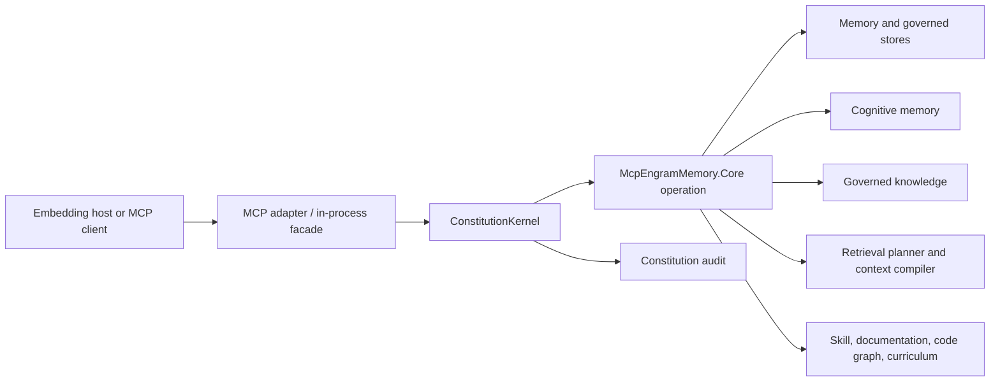

[< Back to README](../README.md)

# Cognitive Constitution and Governed Core

Engram now contains a governed cognitive substrate in `McpEngramMemory.Core`. It keeps ordinary
cognitive memory useful while adding deterministic policy, versioned knowledge, provenance,
learning, retrieval planning, context manifests, and semantic asset contracts.

This is primarily a **Core library surface**. The 63 MCP tools remain the user-facing memory
surface; the full profile exposes `promote_knowledge` as the governed publication adapter and wraps
every tool call in the Constitution filter. Context compilation and other asset-management APIs
remain available to embedding hosts through Core.

## Boundary and execution flow



`McpEngramMemory.Core` owns the domain rules. `McpEngramMemory` is an adapter: it supplies stdio,
dependency injection, MCP tool registration, host-bound principal configuration, and a global
call-tool filter. An in-process host does not receive MCP filtering automatically; it must invoke
the Core Constitution boundary for governed operations itself.

## Root Constitution, overlays, and kernel

The built-in `RootConstitution` is a content-addressed, immutable baseline. Its principles include:

- never destroy provenance;
- knowledge requires evidence;
- memory is not truth;
- preserve contradictions until explicitly resolved;
- derived knowledge cannot broaden source permissions;
- deterministic verification precedes model verification;
- promoted knowledge remains explainable;
- learning actions are auditable.

`ConstitutionComposer` accepts the Root plus zero or more overlays. Composition is monotone:
overlays may require additional safeguards, raise evidence floors, or remove allowed operations;
they cannot relax Root constraints. Published definitions and rules are canonically serialized and
addressed by SHA-256 content hashes.

`DeterministicConstitutionEvaluator` executes registered .NET rules in stable priority/id order. A
missing, mismatched, or throwing rule fails closed. `ConstitutionKernel` converts both decisions and
evaluation failures into audit records before returning a decision.

The MCP server registers `ConstitutionMcpFilter` globally with the MCP request-filter pipeline. It:

1. builds an `OperationEnvelope` from the host principal, tool name, and canonical argument hash;
2. evaluates and audits the precondition;
3. invokes the tool only when allowed;
4. evaluates and audits the postcondition as detection (not retroactive authorization);
5. returns a tool error if either constitutional phase denies the operation.

The shipped Root currently provides the baseline constraints and audit envelope. Hosts can publish
narrowing overlays and register deterministic rules. The server's default provider and audit store
are in-memory, so a restart clears published overlays and MCP audit history unless the embedding
host deliberately wires the file-backed governance stores.

## Memory is not knowledge

| Cognitive memory | Governed knowledge |
|---|---|
| `CognitiveEntry` | `KnowledgeAsset` / immutable `KnowledgeVersion` |
| STM, LTM, archived describe durability | Proposed, Hypothesized, Supported, Verified, Established describe maturity |
| Activation, access count, similarity, and retrieval rank describe use/relevance | Separate calibrated confidence, authority, trust, evidence strength, freshness, and consensus components |
| Mutable lifecycle and association behavior | Versioned claims, temporal validity, status, evidence, permissions, and active-version pointer |
| May be incomplete, stale, contradictory, or injected | Promotion requires governed evidence and verification |

An LTM memory is not therefore true. A frequently recalled memory is not therefore authoritative.
Retrieval scores are ordering signals and never update epistemic maturity.

## Two graph projections

The existing `KnowledgeGraph` is the **cognitive association graph**. Its edges use bare entry IDs,
are mutable and weighted, and support traversal, auto-linking, spreading activation, graph
diffusion, and lifecycle behavior.

Governed derivations use a separate **provenance graph**. `ArtifactRef` identifies an exact
`(tenant, namespace, kind, artifact id, version)` and `ProvenanceAssertion` records typed,
content-addressed, append-only lineage. Provenance is not similarity-auto-linked and does not
participate in cognitive diffusion. Effective permissions are the capability-by-capability
intersection of every exact source permission snapshot.

Do not add provenance by treating another cognitive edge relation as authoritative lineage. The
two projections may reference the same conceptual subject, but their integrity and lifecycle rules
are intentionally different.

## Teacher, Verifier, and promotion

The learning primitives enforce proposal-before-promotion:

```text
authorized evidence
  -> TeacherRuntime emits quarantined KnowledgeProposal
  -> VerifierPlanner runs deterministic, model, then human verifiers as applicable
  -> KnowledgePromotionEvaluator checks evidence, independence, policy, versions, and permissions
  -> Governed promotion commit publishes version + active pointer + provenance + audit
```

The Teacher never publishes established knowledge. Deterministic verifier failure is a veto; model
output cannot override it. Model verification records whether its model, prompt family, and
evidence view are independent of the Teacher. Promotion rechecks the Constitution and resource
versions captured by `CommitAuthorizationSnapshot`, preventing a stale authorization or active
version from being committed.

`InMemoryGovernedKnowledgeStore` is the reference atomic boundary: knowledge version, active
pointer, provenance assertion, and audit record become visible together or not at all. The
file-backed stores described below are individually crash-safe, but are not yet a single durable
transaction spanning every governed record.

## Retrieval planning and context manifests

`RetrievalPlanner` is deterministic and model-free. It authorizes a source before discovery and
authorizes every candidate reference before the relevance adapter can score it. Adapter failures,
non-finite scores, and authorization failures fail closed and appear in the planning trace.

`ContextCompiler` treats a retrieval plan as candidates, not disclosure authorization. It:

- re-authorizes every selected and materialized `ArtifactRef`;
- excludes a fragment if authorization became stale;
- preserves citation, provenance, audit, warning, version, and source references;
- applies item, UTF-8 byte, and deterministic token budgets in stable order;
- reports omissions and returns `Complete`, `Incomplete`, or `Abstained`;
- exposes relevance only as `RelevanceOrderingScore`; a manifest has no inferred truth score.

`ContextManifest` is the machine-readable record of what was actually emitted. The current MCP
`get_context_block` tool predates this compiler and remains a memory context formatter; hosts that
need governed multi-source manifests compose the Core planning APIs directly.

## Profiles and loadouts

`AgentProfile` defines the identity, purpose, available sources, capability ceiling, permission
envelope, retrieval limit, and context-budget ceiling. `AgentLoadout` selects a subset.
`AgentProfileComposer` rejects a loadout that adds a capability, subject grant, source, retrieval
item, or context budget absent from the profile. A loadout can narrow authority; it cannot grant it.

Profiles and loadouts are operating constraints, not artifact authorization. Retrieval and context
compilation still authorize every exact artifact at use time.

## Semantic asset families and execution

Core supplies immutable, content-addressed definitions and publishers for:

- `SkillVersion`: typed parameters, ordered steps, expected outcomes, resources, evidence,
  verification requirements, lifecycle, and permissions;
- `DocumentationVersion`: stable source revision/hash, fragments, citations, provenance, and
  permissions;
- `CodeGraphVersion`: repository/commit/language identity, symbols, references, provenance, and
  incremental extractor contracts;
- `CurriculumVersion`: topologically ordered objectives whose sources must be governed Knowledge
  or published Skill versions permitted for training.

These are Core contracts, not new MCP tools. In particular, Engram does **not** execute skill code.
`SkillExecutionCoordinator` validates lifecycle, permissions, parameters, resources, budgets, and
deterministic verifiers, then delegates to a host-provided `ISkillSandbox`. The host defines process,
filesystem, network, credential, and resource isolation. If sandbox isolation is unspecified, skill
execution is denied.

## Governance persistence and recovery

Core includes opt-in file-backed stores:

| Store | Durability model |
|---|---|
| `FileConstitutionVersionStore` | Tenant-partitioned atomic snapshot of immutable versions and active pointer |
| `FileKnowledgeAssetStore` | Atomic checksum-protected aggregate snapshot per tenant/namespace/artifact |
| `FileProvenanceStore` | Tenant-partitioned, fsync-backed append-only journal |
| `FileConstitutionAuditStore` | Fsync-backed append-only audit journal |
| `FileConstitutionDecisionStore` | Tenant-partitioned replay journal for full decisions |

Snapshots are written to a unique temporary file, flushed to disk, then atomically replaced.
Journals use monotonic sequence numbers and payload checksums. Recovery may truncate only a corrupt
or unterminated final journal record and reports a `PersistenceDiagnostic`; corruption before the
tail, schema mismatches, store mismatches, tenant mismatches, invalid hashes, and inconsistent active
pointers fail closed. Stale pre-replace temporary files are ignored and reported.

Tenant directory names and artifact filenames are hashed to avoid using tenant, namespace, or
artifact strings as paths. These stores are separate from legacy memory persistence and must be
registered explicitly by an embedding host when durable governance is required.

## Identity, tenancy, and current limitation

`IPrincipalContext` is the Core trust input: tenant, agent/principal, system flag, and explicit
legacy status. In the stdio server, `MEMORY_TENANT_ID` and `AGENT_ID` bootstrap one process-wide
`PrincipalContext`. Environment variables are operator configuration, not authentication. A remote
or authenticated host must bind verified request/session claims to its own principal context.

Empty tenant plus the default agent is `PrincipalContext.LegacyUnisolated`. It preserves historical
single-user behavior and is deliberately not described as secure multi-tenant operation.

Memory entry storage and lookup are tenant-aware. The cognitive graph, clusters, lifecycle support
structures, collapse history, diffusion basis, and several synthesis/maintenance paths still use
global bare IDs. Therefore non-empty-tenant principals currently fail closed for the affected
graph, cluster, lifecycle, intelligence, accretion, diffusion, spectral, maintenance, synthesis, and
visualization tools. Admin debate purge can delete tenant entries but intentionally does not mutate
global graph or cluster structures. This is a containment measure, **not** full tenant-qualified
graph support.

See [Security](../SECURITY.md) for the threat boundary and [Architecture](architecture.md) for the
full system map.

## MCP SDK 2.1

The server references `ModelContextProtocol` **2.1.0** and uses its builder-based stdio transport,
request-filter pipeline, schema generation, and tool annotations. Package version and negotiated MCP
protocol revision are different concepts: the SDK and client negotiate the protocol; Engram does not
hard-code a single protocol revision in `Program.cs`.

Every MCP tool declares `ReadOnly`, `Destructive`, `Idempotent`, and `OpenWorld` metadata. These
annotations help clients present and approve calls correctly; they do not replace Constitution,
authorization, sandboxing, or operator policy.
